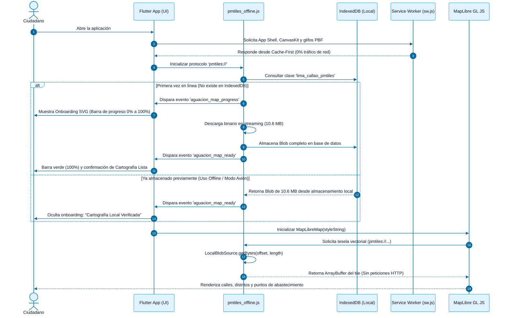

# Memoria y Contexto Consolidado del Proyecto AguaCION (Agua Segura Perú)
**Documento Maestro de Transferencia de Conocimiento y Respaldo Técnico del Informe Institucional**  
*CION - SUNASS (Superintendencia Nacional de Servicios de Saneamiento)*  
*Fecha de Consolidación: 18 de septiembre de 2026*

---

## 1. Resumen Ejecutivo y Estado del Proyecto

* **Denominación del Proyecto:** AguaCION — Agua Segura Perú (App Móvil y PWA de Misión Crítica).
* **Propósito Operativo:** Proveer orientación civil y enrutamiento peatonal autónomo (100% desconectado) hacia los **433 puntos oficiales de distribución de agua potable** de SEDAPAL en Lima Metropolitana y el Callao ante sismos de gran magnitud ($\ge 8.5\ \text{Mw}$), bajo un escenario de caída simultánea del Sistema Eléctrico Interconectado Nacional (SEIN) y las redes de telecomunicaciones.
* **Marco Institucional:** Articulación técnica directa entre el Equipo de Innovación y Transformación Digital (**CION**) y la **Dirección de Fiscalización (DF)** de la **SUNASS**, sobre la base de los expedientes de contingencia de **SEDAPAL** en el marco de la Gestión del Riesgo de Desastres (GRD).
* **Estado de Madurez:** **Proof of Concept (POC) Técnico Endurecido / Producto Mínimo Viable (MVP)**.
* **Despliegue Público de la PWA (Producción):**  
  🔗 [https://cionsunass01-ai.github.io/app-movil-sismo-v2/](https://cionsunass01-ai.github.io/app-movil-sismo-v2/) (Rama: `gh-pages`).
* **Estado del Repositorio:** Rama `main` sincronizada con `origin/main`. Código auditado con `flutter analyze` (0 advertencias) y 32/32 pruebas unitarias aprobadas.

---

## 2. Hallazgos Operacionales y Reglas de Negocio Clave

1. **La Ventana Técnica de 48 Horas de SEDAPAL:**  
   En las mesas de coordinación con la Dirección de Fiscalización, se levantó que los Equipos de Operación y Mantenimiento de Redes (EOMR) de SEDAPAL requieren hasta 48 horas post-desastre para inspeccionar tuberías matrices, reservorios y pozos, y confirmar formalmente qué puntos fijos permanecen presurizados y con agua disponible. El aplicativo móvil incorpora de manera visible y transparente esta advertencia institucional al ciudadano para no generar falsas expectativas de suministro inmediato.
2. **La Brecha del Apagón Digital:**  
   Bajo sismos severos, las herramientas comerciales dependientes de la nube (Google Maps, Waze, Mapbox) quedan completamente inoperativas por la caída de antenas celulares e internet, demostrando la necesidad estricta de una arquitectura *Offline-First* con cero peticiones de red.
3. **La Falacia de la Proximidad en Línea Recta:**  
   El cálculo euclidiano ("en línea recta") induce a errores graves en la población civil ante barreras urbanas reales (ríos como el Rímac, vías expresas sin cruces peatonales, desniveles). Un punto situado a 500 m en línea recta puede representar en realidad una caminata extenuante de 2.8 km (35 min) a pie. Por ello, es obligatorio un motor de ruteo peatonal sobre calles transitables.
4. **Auditoría Geodésica de SEDAPAL:**  
   Se validó matemáticamente el catálogo oficial de 433 puntos de SEDAPAL mediante el script de Python `tools/data_audit/audit_water_points.py`, comprobando que la discrepancia entre coordenadas geográficas (WGS84) y proyectadas (UTM 18S) es de apenas **2.9 cm**, y asignando códigos UBIGEO oficiales a través de la capa canónica del INEI en 36 distritos.
5. **Brecha de Heterogeneidad Nacional y Justificación del MVP:**  
   Al contrastar el dataset de SEDAPAL con los planes de contingencia remitidos por las otras 49 EPS ante la SUNASS, se constató que las demás empresas reportan información dispersa en PDFs escaneados y rutas ambiguas de camiones cisterna sin coordenadas GPS. Esto justificó técnicamente delimitar el MVP a Lima y Callao como piloto estándar de homologación nacional.

---

## 3. Arquitectura Técnica y Logros de Ingeniería

* **Arquitectura Dual Multiplataforma:**
  * **PWA Web Móvil:** MapLibre GL JS integrado con el adaptador propietario `web/pmtiles_offline.js`, IndexedDB (`aguacion_offline_db`), persistencia duradera con `navigator.storage.persist()`, y Service Worker `web/sw.js` con estrategia *Cache-First*.
  * **App Móvil Nativa:** Flutter Engine (compilación AOT) con MapLibre Native C++ acelerado por hardware GPU (Metal en iOS y Vulkan en Android) y lectura directa por `mmap`.
* **Superación del Límite de Peticiones Parciales HTTP (206 Range Requests):**  
  El estándar de Service Worker en navegadores rechaza las peticiones parciales sobre archivos cacheados. Se solucionó descargando el binario cartográfico de 10.6 MB como un único flujo (*stream*), almacenándolo en IndexedDB y delegando la lectura al componente `LocalBlobSource` que ejecuta `blob.slice()` en memoria RAM sin realizar una sola llamada HTTP ni consumir datos móviles.
* **Onboarding Institucional:**  
  Componente visual de preparación con barra de progreso SVG fluida (0% a 100%), sin emojis informales, con iconografía técnica limpia.
* **Motor de Ruteo Peatonal Autónomo (Dart Core):**  
  * **Grafo Binario AGUACSR1:** Formato *Compressed Sparse Row* (855,857 nodos y 1,990,320 aristas dirigidas) comprimido con buffers `Int32List` en microgrados (precisión submétrica con error máx. de 7.5 cm).
  * **Spatial Grid (275 m):** Malla espacial en memoria con indexación $O(1)$ para proyectar la posición del ciudadano (*snapping*) sobre la red vial transitable.
  * **Algoritmo A\* Forward con Poda Adaptativa (`AdaptiveWaterPointSearch`):** Evalúa los 433 puntos oficiales y calcula la ruta mínima en menos de 5 ms.
  * **Bloqueo Dinámico de Aristas:** Permite al ciudadano reportar calles colapsadas por escombros, inhabilitando la vía en la memoria RAM y recalculando al instante un desvío seguro.

---

## 4. Textos Aprobados para el Informe de Actividades (TDR)

### ACTIVIDAD 1: Levantar, analizar y contrastar la información disponible de los procesos priorizados por la Alta Dirección, en articulación con las unidades de organización correspondientes, a fin de identificar brechas y oportunidades de mejora.

> **1.1 Análisis y Levantamiento de Brechas en la Información Geoespacial**  
> En articulación con el equipo técnico de la Dirección de Fiscalización (DF) de la SUNASS, se realizó el levantamiento de la información mediante reuniones de coordinación y la revisión de los expedientes del plan de contingencia ante desastres, recopilando el dataset oficial provisto por SEDAPAL con **433 puntos fijos de distribución metropolitana**. El análisis técnico se efectuó mediante una auditoría matemática de consistencia entre coordenadas geográficas y proyectadas con un margen de discrepancia de apenas **2.9 cm**, complementado con un geoprocesamiento espacial frente a la capa canónica distrital del INEI para asignar códigos UBIGEO a los 36 distritos cubiertos. Esta información fue contrastada frente a los planes de contingencia remitidos por las demás EPS a nivel nacional ante la SUNASS, evidenciando una **brecha crítica de heterogeneidad**: mientras SEDAPAL contaba con infraestructura fija georreferenciada (cámaras, pozos e hidrantes), las otras EPS presentaban únicamente documentos escaneados en PDF con rutas aproximadas de camiones cisterna y descripciones literales sin coordenadas geográficas, lo que delimitó la oportunidad de mejora de centralizar y estructurar primero los datos de Lima y Callao como piloto de homologación técnica para el prototipo de contingencia.

> **1.2 Identificación de Brechas Operativas y Tecnológicas ante Fallas de Conectividad y Vulnerabilidad de Redes**  
> Mediante reuniones de coordinación con la Dirección de Fiscalización, se levantaron los procedimientos y protocolos operativos que seguirá la empresa prestadora tras un sismo de gran magnitud, identificándose formalmente que los Equipos de Operación y Mantenimiento de Redes de SEDAPAL requieren una **ventana técnica de evaluación de daños de hasta 48 horas** para confirmar a la SUNASS qué puntos fijos permanecen presurizados y con agua disponible. El análisis operativo evaluó las capacidades de orientación civil bajo un escenario de fallo simultáneo del Sistema Eléctrico Interconectado Nacional y las redes de telecomunicaciones, contrastando el comportamiento de las herramientas comerciales de mapas (Google Maps, Waze) frente a la realidad del desastre, lo que constató una **brecha crítica de vulnerabilidad** al quedar dichas plataformas completamente inoperativas por su dependencia estricta de internet y servidores remotos. Asimismo, al contrastar la ubicación de los puntos contra la red vial urbana y barreras físicas reales (ríos, autopistas de alta velocidad sin cruce peatonal y desniveles), se detectó que el cálculo tradicional de proximidad en "línea recta" genera falsas expectativas de cercanía y desvíos extenuantes de varios kilómetros para el ciudadano a pie. Esta contrastación delimitó la oportunidad de mejora para la conceptualización del prototipo: diseñar una solución tecnológica de **arquitectura estrictamente Offline-First** que funcione con cero tráfico de datos (mediante lectura directa de sensores GNSS y cartografía local en el dispositivo), incorporando de forma transparente el aviso institucional del plazo de 48 horas y un motor de ruteo peatonal autónomo que guíe a la población de forma segura hacia el punto viable más cercano.

---

### ACTIVIDAD 2: Estructurar propuestas de solución tecnológica a partir del análisis realizado, utilizando herramientas de representación como diagramas, flujogramas y prototipos, orientadas a la conceptualización de un Producto Mínimo Viable (MVP).

> **2.1 Diseño de Arquitectura, Flujogramas de Operación y Prototipos UI/UX para la POC de AguaCION**  
> A partir de las brechas identificadas con la Dirección de Fiscalización, se formuló la propuesta de solución tecnológica para el Producto Mínimo Viable (MVP) mediante un **flujograma operativo organizado en cuatro fases secuenciales** que orientan al ciudadano tras un desastre. En la primera fase, de **preparación y almacenamiento**, la aplicación asegura el mapa metropolitano dentro del propio teléfono e incorpora un aviso institucional transparente sobre el plazo técnico de hasta 48 horas que requiere SEDAPAL para evaluar los daños en sus redes y confirmar qué puntos tienen agua. En la segunda fase, de **ubicación satelital**, se diseñó una pantalla explicativa que garantiza la privacidad del usuario e instruye al dispositivo para captar la señal directa de los satélites GPS, operando sin necesidad de saldo, internet ni antenas celulares. En la tercera fase, de **cálculo de ruta a pie**, el sistema sitúa a la persona sobre la red de calles transitables y evalúa los **433 puntos oficiales de abastecimiento** para trazar el camino peatonal más corto y seguro, evitando el cálculo engañoso en línea recta. Finalmente, en la cuarta fase, de **adaptación ante desastres**, la herramienta permite al usuario marcar si una calle quedó bloqueada por escombros o derrumbes, recalculando en el acto un nuevo desvío seguro hacia la fuente de agua más cercana.

> **2.2 Modelado de Secuencia: Operación Autónoma y Preparación del Mapa en el Dispositivo**  
> Para representar el funcionamiento técnico del Producto Mínimo Viable (MVP), se elaboró un **diagrama de secuencia** que detalla cómo interactúa la aplicación con el teléfono del ciudadano para operar sin conexión a internet. El modelo establece que, al abrir la herramienta, esta cargue de forma instantánea desde la memoria del propio dispositivo, garantizando un acceso inmediato y sin consumo de datos móviles. Asimismo, se diseñó un flujo de preparación transparente para la emergencia: la primera vez que el ciudadano ingresa, la aplicación descarga y asegura en el almacenamiento del teléfono el mapa completo de Lima y Callao (10.6 MB), informando el avance mediante una barra de progreso institucional; de modo que, ante la ocurrencia de un sismo o en Modo Avión, el sistema recupera la cartografía guardada localmente sin depender de servidores remotos. Con este esquema, la herramienta visualiza la red vial y los **433 puntos oficiales de abastecimiento** de forma 100% autónoma, asegurando la orientación ciudadana ante la caída total de las redes de telecomunicaciones.

---

### ACTIVIDAD 3: Implementar soluciones tecnológicas priorizadas, desarrollando componentes funcionales basados en el MVP para mejorar la eficiencia de los procesos, empleando herramientas como Python, SQL e inteligencia artificial, según la naturaleza del requerimiento.

> **3.1 Procesamiento, Normalización y Estructuración de Datos Cartográficos con Python y SQL**  
> Para la implementación de los componentes de datos del Producto Mínimo Viable (MVP), se desarrollaron rutinas automatizadas en **Python** para extraer, depurar y validar la consistencia geográfica del dataset oficial con los **433 puntos fijos de abastecimiento reportados por SEDAPAL**, vinculando automáticamente cada punto con los 36 distritos metropolitanos delimitados por el INEI. De manera complementaria, se aplicaron modelos y consultas espaciales en **SQL** para procesar la red vial de Lima y Callao, filtrando las vías peatonales transitables y empaquetando tanto la cartografía metropolitana como los elementos gráficos en un archivo ligero de solo 10.6 MB, diseñado para residir íntegramente en el teléfono. Este trabajo analítico y de optimización algorítmica garantizó que toda la información de contingencia quedara estructurada, auditada y lista para ser consultada de forma instantánea por el aplicativo, eliminando la dependencia de servidores externos o bases de datos remotas durante un desastre.

> **3.2 Implementación de la Interfaz Móvil y Navegación Peatonal Autónoma sin Conexión**  
> Se construyó y desplegó el aplicativo móvil multiplataforma (compatible con dispositivos Android, iOS y navegadores móviles), priorizando una experiencia de usuario ágil, clara y orientada a la protección civil en situaciones de estrés. La solución tecnológica integra en una sola interfaz el mapa interactivo, el geoposicionamiento por satélite y el catálogo oficial de puntos de agua, permitiendo al ciudadano visualizar de inmediato su entorno sin necesidad de saldo ni cobertura de internet. Asimismo, se incorporó un motor de enrutamiento autónomo que calcula en tiempo real la **ruta a pie más corta y segura** hacia el punto de abastecimiento más cercano, indicando la distancia exacta en metros y el tiempo estimado de caminata sobre las calles reales. Finalmente, se implementó una función de resiliencia que permite al ciudadano reportar vías bloqueadas por escombros o colapsos, calculando de manera automática un desvío alternativo para orientar a la población de forma segura hacia los puntos presurizados.

---

## 5. Galería Oficial de Figuras para el Documento de Word

| Numeral | Figura | Descripción Aprobada para el Pie de Imagen |
| :---: | :---: | :--- |
| **1.1** | **Figura N° 1.1** | **Figura N° 1.1:** *Contrastación de la información de contingencia entre empresas prestadoras a nivel nacional.*<br>*(Izquierda) Plan de contingencia típico de EPS en provincias (Aguas de Lima Norte): mapas impresos escaneados en PDF y rutas aproximadas de camiones cisterna sin coordenadas GPS. (Derecha) Dataset estructurado de SEDAPAL: base de datos georreferenciada con coordenadas geográficas y proyectadas de los puntos fijos de distribución.*<br>**Fuente:** *Planes de contingencia remitidos por las EPS a la Dirección de Fiscalización – SUNASS.* |
| **1.1** | **Figura N° 1.2** | **Figura N° 1.2:** *Síntesis ejecutiva del levantamiento de información y justificación técnica para la delimitación del Producto Mínimo Viable (MVP).*<br>*Identificación de la brecha de heterogeneidad nacional: mientras Lima y Callao cuentan con 433 puntos fijos auditados con una precisión de 2.9 cm en 36 distritos, las demás EPS del país presentan datos descriptivos no digitalizados, justificando priorizar a SEDAPAL como piloto de homologación tecnológica.*<br>**Fuente:** *Elaboración propia – Equipo de Innovación y Transformación Digital (CION-SUNASS).* |
| **1.2** | **Figura N° 1.3** | **Figura N° 1.3:** *Análisis de brechas operativas y territoriales post-sismo y justificación del modelo tecnológico del MVP.*<br>*(1) Inoperatividad de herramientas comerciales de mapas ante el colapso simultáneo del sistema eléctrico y las telecomunicaciones. (2) Falsas expectativas del cálculo de proximidad en línea recta frente a barreras urbanas reales (ríos y autopistas), que incrementan la caminata de 500 m a 2.8 km. (Inferior) Incorporación de la ventana técnica de 48 horas de SEDAPAL y conceptualización de la solución Offline-First con GPS satelital puro y ruteo peatonal autónomo.*<br>**Fuente:** *Elaboración propia – Equipo de Innovación y Transformación Digital (CION-SUNASS).* |
| **2.1** | **Figura N° 2.1** | **Figura N° 2.1:** *Flujograma operativo del ciclo de vida del ciudadano y navegación peatonal desconectada para el MVP de AguaCION.*<br>*Estructuración del proceso de orientación en cuatro fases consecutivas: (Fase 1) Descarga y aseguramiento del mapa local en el teléfono con el aviso institucional de 48 horas; (Fase 2) Captación directa de coordenadas satelitales (GPS) con garantía de privacidad ciudadana; (Fase 3) Cálculo de la ruta peatonal más corta hacia el punto oficial más cercano; y (Fase 4) Función de resiliencia ante desastres mediante el reporte de calles bloqueadas por escombros y recálculo inmediato de desvíos seguros.*<br>**Fuente:** *Elaboración propia – Equipo de Innovación y Transformación Digital (CION-SUNASS).* |
| **2.2** | **Figura N° 2.2** | **Figura N° 2.2:** *Diagrama de secuencia de la interacción técnica para el arranque instantáneo, almacenamiento en el dispositivo y renderizado del mapa sin conexión.*<br>*Interacción entre la interfaz de usuario, los componentes de almacenamiento local y el motor cartográfico: (1) Carga inicial inmediata desde la memoria del teléfono sin consumir datos móviles; (2) Bifurcación condicional (`alt`): descarga en la primera conexión asegurando los 10.6 MB del mapa en el almacenamiento interno con barra de progreso, frente a la recuperación inmediata en Modo Avión; y (3) Consulta y renderizado de las calles y puntos de abastecimiento directamente desde la memoria local sin llamadas a servidores remotos.*<br>**Fuente:** *Elaboración propia – Equipo de Innovación y Transformación Digital (CION-SUNASS).* |
| **3.1** | **Figura N° 3.1** | **Figura N° 3.1:** *Procesamiento de datos en Python y despliegue de los 433 puntos oficiales en AguaCION.*<br>*(Izquierda) Script de Python para la auditoría y conversión matemática de coordenadas. (Derecha) Visualización funcional de los 433 puntos de abastecimiento de SEDAPAL en el aplicativo móvil.*<br>**Fuente:** *Elaboración propia (CION-SUNASS).* |
| **3.2** | **Figura N° 3.2** | **Figura N° 3.2:** *Flujo operativo y componentes de interfaz del aplicativo móvil AguaCION.*<br>*(1) Pantalla de inicio con acceso directo y estado de datos locales sin internet. (2) Notificación institucional sobre la ventana técnica de 48 horas de SEDAPAL. (3) Navegación peatonal activa sobre calles reales con cálculo de distancia (km) y tiempo estimado de caminata. (4) Módulo funcional para el reporte ciudadano de incidencias hacia la SUNASS y la EPS.*<br>**Fuente:** *Elaboración propia – Equipo de Innovación y Transformación Digital (CION-SUNASS).* |

---

## 6. Códigos Mermaid Optimizados para Exportación

### Código para Figura 2.1 (Flujograma Horizontal del Ciclo de Vida)

```mermaid
%%{init: {'theme': 'base', 'themeVariables': { 'primaryColor': '#E0F2FE', 'primaryBorderColor': '#0284C7', 'primaryTextColor': '#0F172A', 'lineColor': '#0284C7', 'fontSize': '13px', 'fontFamily': 'Arial'}}}%%
flowchart LR
    START([1. Inicio de la App]) --> DETECT{¿Primera vez en PWA<br>o falta cartografía?}

    subgraph FASE1 ["Fase 1: Onboarding y Almacenamiento Local"]
        direction TB
        DETECT -- Sí --> ONB_DL["Descarga Streaming de Cartografía<br><b>Barra de Progreso SVG (0% a 100%)</b>"]
        ONB_DL --> IDB_STORE["Guardado en IndexedDB Local<br><b>('aguacion_offline_db' 10.6 MB)</b>"]
        IDB_STORE --> PERSIST["Cuota Persistente de Disco<br><b>navigator.storage.persist()</b>"]
        PERSIST --> MOD_A2HS["Modal Asistido de Instalación<br><b>(Agregar a Pantalla de Inicio)</b>"]
        
        DETECT -- No --> IDB_LOAD["Montaje de PMTiles en Memoria<br><b>(LocalBlobSource o mmap)</b>"]
        
        MOD_A2HS --> DISCLAIMER["Despliegue de Aviso Institucional<br><b>(Sujeto a confirmación técnica 48h)</b>"]
        IDB_LOAD --> DISCLAIMER
    end

    subgraph FASE2 ["Fase 2: Geoposicionamiento Satelital Offline"]
        direction TB
        DISCLAIMER --> LOC_CHECK{"¿Tiene permiso<br>de Ubicación?"}
        
        LOC_CHECK -- No --> MOD_PRIMER["Modal Educativo de Privacidad<br><i>(Explica cálculo local sin datos)</i>"]
        MOD_PRIMER --> REQ_GPS["Solicitud de GPS Nativo al Dispositivo"]
        REQ_GPS --> LOC_OK{"¿Permiso<br>concedido?"}
        
        LOC_CHECK -- Sí --> GET_COORDS["Lectura Satelital Directa<br><b>Sensor GNSS (Cold-Start sin Red)</b>"]
        LOC_OK -- Sí --> GET_COORDS
        LOC_OK -- No --> FALLBACK_MAP["Centro Neutral Plaza Mayor<br><b>Selección manual de punto</b>"]
    end

    subgraph FASE3 ["Fase 3: Motor de Enrutamiento Autónomo"]
        direction TB
        SNAPPING["Snapping Ortogonal a Red Vial<br><b>(Spatial Grid 275m)</b>"]
        ADAPT_SEARCH["Búsqueda Adaptativa Geodésica<br><b>Poda de los 433 puntos oficiales</b>"]
        ASTAR["Ejecución Algoritmo A* Forward<br><b>Cálculo sobre Grafo Binario AGUACSR1</b>"]
        RENDER_ROUTE["Visualización de Ruta Óptima<br><b>Polilínea, Distancia y Tiempo a Pie</b>"]
        
        SNAPPING --> ADAPT_SEARCH --> ASTAR --> RENDER_ROUTE
    end

    subgraph FASE4 ["Fase 4: Resiliencia ante Desastres"]
        direction TB
        OBSTACLE{"¿Vía bloqueada<br>por escombros?"}
        REACH_POINT([Llegada Segura al<br>Punto de Abastecimiento])
        BLOCK_EDGE["Reportar Vía Bloqueada en Pantalla<br><b>Bloqueo Dinámico de Arista en RAM</b>"]
        
        OBSTACLE -- No --> REACH_POINT
        OBSTACLE -- Sí --> BLOCK_EDGE
    end

    %% Conexiones entre fases horizontales
    GET_COORDS ==> SNAPPING
    FALLBACK_MAP ==> SNAPPING
    RENDER_ROUTE ==> OBSTACLE
    BLOCK_EDGE ==>|Recálculo Inmediato| ASTAR

    classDef default font-family:Arial,font-size:13px;
    classDef highlight fill:#DCFCE7,stroke:#16A34A,stroke-width:2px,color:#14532D;
    class REACH_POINT highlight;
```


### Código para Figura 2.2 (Diagrama de Secuencia de Arranque y Renderizado)


---

## 7. Comandos de Compilación, Calidad y Despliegue

### Validación y Calidad de Código
```powershell
# Análisis de linter estático (0 advertencias)
flutter analyze

# Suite de pruebas unitarias (32/32 pasando)
flutter test
```

### Compilación y Servidor Local PWA
```powershell
# Ejecución en Chrome en modo desarrollo
flutter run -d chrome

# Servir versión compilada localmente con IndexedDB real
npx serve build\web
# o alternativamente:
npx http-server build\web -p 8080
```

### Compilación y Despliegue PWA en Producción (GitHub Pages)
```powershell
# 1. Compilar PWA con base-href institucional
flutter build web --base-href "/app-movil-sismo-v2/" --release

# 2. Reemplazar worker por defecto por sw.js Cache-First offline
Copy-Item -Force build\web\sw.js build\web\flutter_service_worker.js

# 3. Desactivar Jekyll para permitir archivos especiales
New-Item -ItemType File -Force -Path build\web\.nojekyll
```

### Compilación Móvil Nativa (Android / iOS)
```powershell
# Compilación APK Release para Android
flutter build apk --release
# Salida: build\app\outputs\flutter-apk\app-release.apk

# Compilación Release para iOS
flutter build ios --release --no-codesign
```

---

## 8. Mapa de Rutas de Archivos Críticos del Proyecto

* **Script Python de Auditoría Geodésica (UTM a WGS84, 2.9 cm):**  
  [`tools/data_audit/audit_water_points.py`](tools/data_audit/audit_water_points.py)
* **Dataset Normalizado de 433 Puntos Oficiales:**  
  [`assets/poc/data/water_points_normalized.json`](assets/poc/data/water_points_normalized.json)
* **Cartografía Vectorial Offline PMTiles (Zoom 0-14, 10.6 MB):**  
  [`assets/poc/maps/lima_callao_z14.pmtiles`](assets/poc/maps/lima_callao_z14.pmtiles)
* **Estilo Cartográfico Offline MapLibre:**  
  [`assets/poc/styles/emergency_geometric_style.json`](assets/poc/styles/emergency_geometric_style.json)
* **Grafo Binario Peatonal CSR:**  
  [`assets/poc/routing/lima_routing_graph.bin`](assets/poc/routing/lima_routing_graph.bin)
* **Adaptador PWA Offline (IndexedDB + LocalBlobSource + Onboarding SVG):**  
  [`web/pmtiles_offline.js`](web/pmtiles_offline.js)
* **Service Worker Cache-First:**  
  [`web/sw.js`](web/sw.js)
* **Motor de Ruteo A\* y Búsqueda Adaptativa (Dart):**  
  [`lib/poc/offline_navigation/routing/offline_routing_engine.dart`](lib/poc/offline_navigation/routing/offline_routing_engine.dart)
* **Documentación Arquitectónica y Operativa:**  
  - [`documentacion/Diseño_de_Arquitectura.md`](documentacion/Diseño_de_Arquitectura.md)
  - [`documentacion/Flujograma.md`](documentacion/Flujograma.md)
  - [`documentacion/Evaluacion_Factibilidad_PWA.md`](documentacion/Evaluacion_Factibilidad_PWA.md)
  - [`docs/PROJECT_STATUS_AGUACION.md`](docs/PROJECT_STATUS_AGUACION.md)
