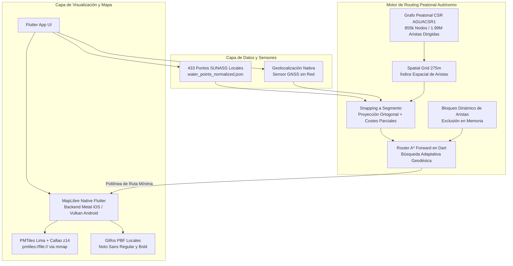

# AguaCION / Agua Segura Perú
## Estado Actual del Proyecto (Versión 3.0 — Consolidada Post-Hito 3A)

**Contexto institucional:** Superintendencia Nacional de Servicios de Saneamiento (SUNASS)
**Proyecto:** AguaCION / Agua Segura Perú
**Fecha del Reporte:** 11 de septiembre de 2026
**Estado del Repositorio:** Suite de pruebas automatizadas en verde (`32/32 tests pass`), análisis estático sin advertencias (`flutter analyze 0 issues`), cero dependencias remotas
**Último Hito Completado:** Hito 3A — Modelo Operacional de Puntos de Abastecimiento (`REVISIÓN CORRECTIVA COMPLETADA`)
**Nivel de Madurez:** Modelo de Dominio Operacional Puro Implementado + Núcleo Tecnológico Offline Validado Físicamente en Android (Samsung S24) e iOS (Apple iPhone)

---

## 1. Resumen Ejecutivo

AguaCION (Agua Segura Perú) es una iniciativa técnica orientada a resolver un problema crítico de supervivencia urbana: la orientación y el encaminamiento peatonal de ciudadanos hacia puntos provisionales de abastecimiento de agua potable en Lima Metropolitana y el Callao durante emergencias de gran escala (como un sismo de magnitud $\ge 8.5\ \text{Mw}$), bajo un escenario de fallo simultáneo o colapso de las redes comerciales de Internet, telefonía celular y suministro eléctrico.

El proyecto está concebido para la población civil que, tras un desastre, requiere obtener agua para consumo básico. Las capacidades de plataformas cartográficas comerciales (Google Maps, Waze, Apple Maps) pueden verse limitadas sin conectividad o sin datos previamente descargados, mientras que AguaCION empaqueta explícitamente todos los recursos de emergencia necesarios —la cartografía vectorial con nombres de calles, el catálogo de puntos oficiales de contingencia y el motor de enrutamiento autónomo— en el almacenamiento interno del dispositivo móvil, operando bajo una estricta arquitectura *Offline-First*.

Hasta la fecha se han alcanzado los siguientes hitos de ingeniería:
1. **Auditoría y Normalización de Datos Oficiales:** Análisis exhaustivo de los 433 puntos de abastecimiento provistos por SEDAPAL a SUNASS, con 100% de consistencia geodésica entre coordenadas geográficas y proyección UTM (error medio de 2.99 cm y máximo de 7.45 cm) y vinculación territorial al 100% con la capa distrital oficial INEI 2023.
2. **Arquitectura Cartográfica Desconectada:** Renderizado por GPU de teselas vectoriales metropolitanas completas (Zoom 0 a 14) mediante MapLibre Native Flutter leyendo directamente un archivo PMTiles de 10.17 MB vía `mmap` del sistema operativo, sin utilizar microservidores HTTP locales (`LOCAL_LOOPBACK_SERVER_USED = NO`).
3. **Etiquetas Cartográficas Offline (Hito 2D):** Visualización de nombres de avenidas, calles, ríos y distritos mediante un sistema de glifos tipográficos locales PBF (`Noto Sans Regular` y `Noto Sans Bold`, 419 KB, licencia OFL 1.1) con cero solicitudes remotas a la red.
4. **Motor de Enrutamiento Peatonal Propio:** Algoritmo $A^*$ monodireccional / forward implementado en Dart sobre un grafo binario comprimido (formato propietario `AGUACSR1` de 855,857 nodos y 1,990,320 aristas dirigidas), con precisión submétrica mediante enteros Int32 en microgrados (error de quantización máximo de 7.5 cm).
5. **Búsqueda Adaptativa y Snapping Continuo:** Algoritmo `AdaptiveWaterPointSearch` que garantiza encontrar la infraestructura más conveniente a pie reduciendo en más de 98% las evaluaciones computacionales frente a la búsqueda exhaustiva.
6. **Auditoría de Acceso Peatonal (Hito 2D):** Inspección individual de los 25 puntos que al umbral base de 50 metros arrojaban `SNAP_NOT_FOUND`, comprobando que 18 de ellos (72.0%) se conectan limpiamente a 100 metros y formalizando el modelo conceptual `WaterPointAccess` con cero coordenadas inventadas.
7. **Validación Multiplataforma:** Validación física en hardware Android real (Samsung Galaxy S24, Android 16) con mediana de cálculo de 1.72 ms en modo Profile sin red, y generación exitosa del paquete nativo de release para iOS (`Runner.app`, 89.3 MB) con MapLibre compilado sobre Metal.

Es indispensable enfatizar que el proyecto se encuentra en estado de **Proof of Concept (POC) Técnico Endurecido**. No es un producto final de distribución pública ni cuenta aún con capas de sincronización en la nube, crowdsourcing ciudadano ni disponibilidad dinámica de agua en tiempo real.

---

## 2. Problema que Busca Resolver

En un escenario hipotético de sismo destructivo en la costa central del Perú, la rotura masiva de tuberías matrices y la afectación del Sistema Eléctrico Interconectado Nacional (SEIN) provocarían la suspensión prolongada del servicio de agua por red pública. Paralelamente, la congestión extrema, el agotamiento de fuentes de energía de respaldo o el daño estructural de antenas de telecomunicaciones degradarían sustancialmente la cobertura celular.

Bajo este contexto, los ciudadanos enfrentan barreras críticas:
1. **Dependencia de Servidores en la Nube:** Los servicios de mapas tradicionales requieren conectividad continua para descargar teselas cartográficas dinámicas y resolver rutas en servidores centrales remotos.
2. **Desconocimiento de la Red de Contingencia:** La ciudadanía desconoce qué hidrantes, pozos o cámaras están designados como puntos de abastecimiento provisional fijo y cuáles son sus ubicaciones geográficas exactas.
3. **Engaño de la Distancia en Línea Recta:** Guiarse por la proximidad euclidiana o visual puede conducir a errores graves: un punto a 500 metros en línea recta puede estar inaccesible por el cruce de una vía expresa sin paso peatonal, el cauce de un río o una pendiente pronunciada, forzando desvíos extenuantes de varios kilómetros.
4. **Vías Urbanas Obstruidas:** Derrumbes de muros y escombros alteran la red transitable, requiriendo recálculos inmediatos en memoria sin depender de reportes de tráfico en línea.

AguaCION resuelve esta problemática transformando el teléfono inteligente en una herramienta de orientación civil autónoma que funciona de forma completamente desconectada.

---

## 3. Propuesta AguaCION

El modelo de operación de AguaCION articula una cadena secuencial de componentes locales dentro del dispositivo:

```
[ Usuario en Emergencia ]
          │
          ▼
   1. Sensor GNSS / GPS ───────(Posición sin Internet: Lat, Lon)
          │
          ▼
   2. Puntos SUNASS / SEDAPAL ─(433 Puntos Oficiales Normalizados en Local)
          │
          ▼
   3. Mapa Vectorial + Nombres (PMTiles Lima+Callao z14 + Glyphs PBF vía MapLibre GPU)
          │
          ▼
   4. Snapping Urbano ─────────(Proyección a red vial peatonal con costes parciales)
          │
          ▼
   5. Routing A* Forward ──────(Búsqueda Adaptativa sobre Grafo CSR de aristas dirigidas)
          │
          ▼
   6. Ruta Visualizada ────────(Polilínea mínima según grafo peatonal hacia el punto alcanzable)
```

### Estado Técnico de los Componentes:

| Componente | Rol en la Propuesta | Estado Técnico |
| :--- | :--- | :---: |
| **Posicionamiento GNSS** | Adquirir coordenadas del usuario sin triangulación celular ni Wi-Fi. | **PROBADO** |
| **Catálogo de Puntos** | 433 ubicaciones oficiales con metadata normalizada y UBIGEO INEI. | **VERIFICADO** |
| **Cartografía Vectorial** | Teselas vectoriales de Lima y Callao renderizadas por GPU vía PMTiles. | **PROBADO** |
| **Etiquetas Cartográficas**| Nombres de calles y distritos renderizados offline con glifos PBF locales. | **PROBADO** |
| **Grafo Peatonal Propio** | Red vial caminable de 855k nodos en formato binario continuo `AGUACSR1`. | **IMPLEMENTADO** |
| **Snapping y A\* Forward** | Proyección tangencial continua y cálculo de ruta mínima en milisegundos. | **PROBADO** |
| **Bloqueo Dinámico** | Recálculo instantáneo en memoria ante calles bloqueadas simuladas. | **IMPLEMENTADO** |
| **Auditoría de Acceso** | Análisis individual de 25 puntos a 50m/100m con taxonomía neutral. | **VERIFICADO** |
| **Disponibilidad de Agua** | Saber si el punto tiene agua física presurizada en tiempo real. | **PENDIENTE** |
| **Sincronización P2P** | Compartir reportes de congestión o daño vía Bluetooth/Wi-Fi Direct. | **HIPÓTESIS / FUTURO** |
| **Mecanismo Blockchain** | Auditoría descentralizada de repartos. | **NO PREVISTO PARA MVP**|

---

## 4. Base de Datos Oficial de Abastecimiento

La información oficial de abastecimiento proviene de los informes remitidos por SEDAPAL a SUNASS en el marco de las acciones de fiscalización:

* **Documentos Fuente Oficiales:**
  * `Abastecimiento_Lima_metro.xlsx` (Dataset consolidado de 433 registros de SEDAPAL, corte 19/08/2026, SHA-256: `f5547afba56b52c1816369a593419ae50d73ea9bf54ce265eb4cc18a293fbe5c`).
  * `CARTA 1089.pdf` (Carta N° 1089-2026-GG de SEDAPAL a SUNASS, 19/08/2026).
  * `INFORME N° 052-2026-EOMR-SJL.pdf` (Informe técnico de los 7 Equipos de Operación y Mantenimiento de Redes - EOMR).
* **Número Total de Registros Oficiales:** Exactamente 433 puntos fijos.
* **Fecha de Corte de la Fuente (`dataset_source_date`):** 19 de agosto de 2026. Se aclara que esta fecha corresponde a la entrega de la información y no a la fecha de instalación física de las obras (`valid_from = null`).
* **Cobertura Territorial:** Lima Metropolitana y la Provincia Constitucional del Callao.

### Distribución Oficial por EOMR:

| EOMR | Jurisdicción Operacional | Número de Puntos | % del Total |
| :--- | :--- | :---: | :---: |
| **EOMR-Comas** | Lima Norte (Comas, Carabayllo, Independencia, etc.) | 140 | 32.33% |
| **EOMR-Ate Vitarte** | Lima Este (Ate, Chaclacayo, Lurigancho-Chosica, etc.) | 103 | 23.79% |
| **EOMR-Surquillo** | Lima Sur / Centro-Sur (Surquillo, Surco, Miraflores, etc.) | 61 | 14.09% |
| **EOMR-SJL** | San Juan de Lurigancho | 42 | 9.70% |
| **EOMR-Callao** | Callao y distritos chalacos | 40 | 9.24% |
| **EOMR-Breña** | Lima Centro (Breña, Cercado, etc.) | 32 | 7.39% |
| **EOMR-Villa El Salvador** | Lima Sur (VES, SJM, VMT) | 15 | 3.46% |
| **TOTAL** | **Área Metropolitana Consolidada** | **433** | **100.00%** |

### Distribución por Tipo de Componente Oficial:

| Tipo de Componente Oficial | Cantidad | % del Total | Interpretación Técnica (No Definición Oficial) |
| :--- | :---: | :---: | :--- |
| **Hidrante** | 339 | 78.29% | Válvula de red pública con conexión para mangueras/despacho |
| **Pozo** | 36 | 8.31% | Captación de agua subterránea |
| **Cámara de rebombeo** | 25 | 5.77% | Estación de presurización de red |
| **GRIFO AMARILLO** | 15 | 3.46% | Nomenclatura local exclusiva de EOMR-Villa El Salvador |
| **Sector** | 12 | 2.77% | Estructura de sectorización de red |
| **Surtidor** | 2 | 0.46% | Instalación de carga para camiones cisterna |
| **Cámara de bombeo** | 1 | 0.23% | Estación de impulsión hidráulica |
| **Cámara SCADA** | 1 | 0.23% | Cámara con instrumentación de monitoreo |
| **Cámara de derivación** | 1 | 0.23% | Bifurcación de tubería matriz |
| **Reservorio** | 1 | 0.23% | Almacenamiento de agua superficial/elevado |
| **TOTAL** | **433** | **100.00%** | Consolidado metropolitano |

---

## 5. Hallazgos de Calidad de Datos

1. **Gestión de Identificadores (`water_point_id` vs `source_record_fingerprint`):**
   * El campo original `Nombre o C` presentó deficiencias (1 nulo en SJL, 15 nombres repetidos `"ATARJEA"` en VES y 10 duplicados `R-P1` a `R-P5` en Ate).
   * Se distingue conceptualmente:
     * `water_point_id`: Identificador canónico persistente en AguaCION.
     * `source_record_fingerprint`: Hash criptográfico de los atributos recibidos en una versión específica de la fuente.
   * Futuras actualizaciones deben conciliar registros para conservar el `water_point_id`, evitando que variaciones menores en atributos generen activos artificialmente nuevos.
2. **Ciclo de Vida de los Registros:**
   * Se mantiene la separación estricta entre el estado operativo del punto y su `lifecycle_status`.
   * Si un registro no figura en una nueva entrega de datos oficial, su estado transiciona a `MISSING_FROM_LATEST_SOURCE` o `PENDING_REVIEW`, no a `RETIRED` de forma automática.
3. **Consistencia Centimétrica de Coordenadas:**
   * El 100% de los puntos (433/433) cuenta con coordenadas geográficas y proyectadas UTM Zona 18S oficiales.
   * La discrepancia geodésica entre ambas representaciones presenta una **consistencia centimétrica**: un error medio de **2.99 cm** y un error máximo de **7.45 cm** (FID 406), producto del redondeo original a dos decimales en la fuente.
4. **Indeterminación de la `Capacidad`:**
   * El campo consigna valores numéricos (303 puntos con `15.00`, 89 con `2.00`, 38 con `8.60`), pero **sin especificar unidad de medida**.
   * Se clasifica formalmente como `capacity_unit = UNKNOWN`. No se realizan cálculos de volumen ni autonomía.
5. **Matriz de `Situación` y `Estado`:**
   * Se comprobó la presencia de **111 puntos con `Situación = Operativo` y `Estado = En reserva`** (32 en Callao y 79 en Comas).
   * La semántica se mantiene etiquetada como `situation_status_semantics = PENDING_INSTITUTIONAL_DEFINITION`.
6. **Grupo Electrógeno (`Cuenta con`):**
   * 358 puntos (82.68%) registran `"No"` o `"NO"`.
   * 64 puntos (14.78%) registran `"No corresponde"` (red por gravedad).
   * 11 puntos (2.54%) declaran contar con generador (`"Sí"`: 9 en Comas, 2 en Ate).

---

## 6. Cobertura Territorial

Mediante el cruce geoespacial con la **Capa Distrital 2023 del Portal IDE del INEI** (`DISTRITO.gpkg`):
* **Distritos con Puntos Oficiales Fijos Dentro de sus Límites:** **36 distritos** (72.0%).
* **Distritos sin Puntos Oficiales Fijos Dentro de sus Límites:** **14 distritos** (28.0%): Ancón, Jesús María, La Perla, Lurín, Magdalena del Mar, Mi Perú, Pachacámac, Pucusana, Punta Hermosa, Punta Negra, Rímac, San Bartolo, Santa María del Mar y Santa Rosa.
* **Cobertura de Código UBIGEO Oficial:** 100% (433/433 asignados).
* **Criterio Institucional:** La ausencia de puntos en el dataset oficial de SEDAPAL no implica necesariamente desabastecimiento; la modalidad de atención (cisternas, puntos móviles o acuerdos vecinales) requiere definición de SUNASS y SEDAPAL.

---

## 7. Arquitectura Técnica Actual



---

## 8. Cartografía y Etiquetas Offline

* **Contenedor Vectorial:** `lima_callao_z14.pmtiles` (10.17 MB), cubriendo `[-77.2600, -12.4200]` a `[-76.5600, -11.7000]`.
* **Auditoría de Nombres Viales:** $\mathbf{STREET\_NAME\_ATTRIBUTES\_PRESENT = YES}$. Se comprobó que el PMTiles existente conserva atributos completos (`name`, `name:es`, `ref`, `kind`, etc.).
* **Sistema de Glifos Tipográficos Locales:**
  * Fuentes: `Noto Sans Regular` y `Noto Sans Bold` (419 KB en formato `.pbf`, rangos 0–255 y 256–511).
  * Licencia: SIL Open Font License (OFL) 1.1.
  * Soporte de Idioma: Caracteres del español (`á`, `é`, `í`, `ó`, `ú`, `ñ`, `Ñ`, `¿`, `¡`) completamente operativos.
  * Mecanismo: `PmtilesManager` desempaqueta los PBFs a `${docsDir}/fonts/{fontstack}/{range}.pbf` y configura el estilo vía URIs `file://`.
* **Servidor Loopback Local:** $\mathbf{LOCAL\_LOOPBACK\_SERVER\_USED = NO}$. MapLibre lee el PMTiles por `mmap` C++ directo.
* **Peticiones de Red:** CERO solicitudes remotas (`0 / N`, sin endpoints `http://` o `https://`).

---

## 9. Grafo de Routing Peatonal

* **Especificación:** Formato binario propietario `AGUACSR1` (*Compressed Sparse Row*).
* **Nodos:** **855,857 nodos** (intersecciones y vértices de trayectoria).
* **Aristas Dirigidas:** **1,990,320 aristas dirigidas del grafo peatonal**.
* **Representación de Coordenadas:** Microgrados en enteros con signo de 32 bits (`Int32`, $10^{-6}$ grados) con error de quantización espacial máximo de **7.5 cm**.
* **Costes de Aristas:** Enteros sin signo de 16 bits (`Uint16`) en decímetros ($0.1$ m).
* **Índice Espacial (`EdgeSpatialGrid`):** Rejilla uniforme de celdas cuadradas de $275\text{ metros}$.
* **Algoritmo de Ruteo:** $A^*$ monodireccional / forward con heurística admisible de Haversine.
* **Dimensionamiento:** 30.67 MB descomprimido en almacenamiento interno; 15.31 MB en asset comprimido (`.bin.gz`).

---

## 10. Rendimiento del Routing

Mediciones obtenidas sobre hardware físico Android en condiciones de cero conectividad (Modo Profile):
* **Dispositivo:** Samsung Galaxy S24 (`SM-S921B`), Android 16 (API 36).
* **Condición:** Wi-Fi `OFF`, Datos Móviles `OFF`, GNSS `ON`.

### Benchmark Físico de 30 Rutas Peatonales en Android:

| Categoría de Ruta | Distancia | Cantidad ($N$) | Media | Mediana (p50) | p95 | Peor Caso | Nodos Explorados |
| :--- | :---: | :---: | :---: | :---: | :---: | :---: | :---: |
| **Rutas Cortas** | $< 1.0$ km | 10 | 1.53 ms | 1.45 ms | 2.75 ms | 2.75 ms | 321 nodos |
| **Rutas Medias** | $1.0 - 3.0$ km | 10 | 3.03 ms | 1.78 ms | 8.69 ms | 8.69 ms | 1,716 nodos |
| **Rutas Largas** | $3.0 - 10.0$ km | 10 | 8.00 ms | 4.49 ms | 35.74 ms | 35.74 ms | 7,464 nodos |
| **TOTAL GENERAL** | **$0.2 - 8.5$ km** | **30** | **4.18 ms** | **1.72 ms** | **18.92 ms** | **35.74 ms** | **3,167 nodos** |

### Benchmark Físico de 30 Rutas Peatonales en Apple iPhone (Hardware Real):
* **Dispositivo:** Apple iPhone (`iPhone de pruebas`), iOS 26.5 (Build 23F77, `ios-arm64`).
* **Condición:** Wi-Fi `OFF`, Datos Móviles `OFF`, Conexión USB física para logs, Modo Profile AOT (`97.9 MB`).

| Categoría de Ruta | Distancia | Cantidad ($N$) | Media | Mediana (p50) | p95 | Peor Caso |
| :--- | :---: | :---: | :---: | :---: | :---: | :---: |
| **Rutas Cortas** | $< 1.0$ km | 10 | **1.73 ms** | **1.71 ms** | **2.61 ms** | **2.61 ms** |
| **Rutas Medias** | $1.0 - 3.0$ km | 10 | **3.40 ms** | **2.17 ms** | **8.41 ms** | **8.41 ms** |
| **Rutas Largas** | $3.0 - 10.0$ km | 10 | **6.20 ms** | **2.66 ms** | **25.93 ms** | **25.93 ms** |
| **TOTAL GENERAL** | **$0.2 - 8.5$ km** | **30** | **3.78 ms** | **2.09 ms** | **15.36 ms** | **25.93 ms** |

*Definición Metodológica:* El sistema calcula la **ruta mínima según el grafo peatonal disponible y la función de coste utilizada**. No implica una garantía de seguridad física frente a peligros post-desastre no cartografiados. Ambas plataformas móviles demostraron resolver el 95% de las rutas en menos de 19 ms (18.92 ms en Android, 15.36 ms en iPhone).

---

## 11. Comparativa: Grafo Peatonal vs. Distancia en Línea Recta

Se demostró experimentalmente que seleccionar el punto más cercano mediante distancia geodésica euclidiana (Haversine) puede inducir a desvíos críticos:

* **Caso Ate Vitarte (Lima Este):**
  Punto más cercano en línea recta: `WP-SED-ATE-0B721B0FA9` (1,120 m euclidianos, pero >6,380 m reales a pie por separación de autopista y cerro).
  Punto ganador por grafo: `WP-SED-ATE-EDFDF729AD` (1,450 m euclidianos, pero solo 746.2 m reales a pie por vereda accesible).
  *Resultado:* Una diferencia de **5,638 metros** (la máxima diferencia observada en los escenarios experimentales evaluados).
* **Caso Los Olivos (Lima Norte):**
  El cálculo peatonal evitó la asignación de un punto al otro lado de la Carretera Panamericana Norte carente de paso peatonal inmediato, seleccionando un punto en el mismo margen transitable.

---

## 12. Optimización de Búsqueda Adaptativa

El algoritmo `AdaptiveWaterPointSearch` aplica el principio de desigualdad triangular como cota inferior estricta:
$$D_{\text{ruta}}(O, P_k) \ge h(O, P_k)$$
Si al evaluar los puntos ordenados por proximidad euclidiana se comprueba que la distancia en línea recta al candidato $P_k$ supera o iguala la distancia de la mejor ruta encontrada, la búsqueda se detiene.

* **Efectividad contra Oráculo Exhaustivo (433 rutas):** **20 / 20 (100.0%) de coincidencia exacta**.
* **Candidatos $A^*$ Evaluados:** Mediana de 1 candidato (p50); p95 de 4 candidatos.
* **Reducción de Cómputo:** Mayor al **98%** respecto al cálculo exhaustivo.

---

## 13. Conexión a la Red Peatonal (Snapping)

El proceso de snapping proyecta la coordenada sobre el segmento vial más cercano, aplicando distancias ortogonales y costes parciales proporcionales sobre la arista.

### Cobertura Experimental según Umbral:

| Umbral Evaluado | Puntos Conectados | % Cobertura | SNAP_NOT_FOUND | Distancia Media al Eje |
| :--- | :---: | :---: | :---: | :---: |
| **30 metros** | 388 / 433 | 89.6% | 45 | 9.0 m |
| **50 metros (Línea Base)** | **408 / 433** | **94.2%** | **25** | **10.6 m** |
| **100 metros** | **426 / 433** | **98.4%** | **7** | **13.1 m** |

---

## 14. Auditoría de los 25 Puntos sin Conexión Inmediata (Hito 2D)

Durante el Hito 2D se ejecutó una auditoría individualizada y neutral sobre los 25 puntos que al umbral base de 50 metros presentaban `SNAP_NOT_FOUND`:

1. **Comportamiento al Ampliar el Umbral a 100 Metros:**
   * **18 puntos (72.0%) se conectan limpiamente a la red peatonal urbana**, con una distancia media de 69.8 metros al segmento transitable (rango: 51.5 m a 97.8 m).
   * **7 puntos (28.0%) permanecen a más de 100 metros:** FID 36 (136.7 m), FID 100 (228.5 m), FID 147 (102.0 m), FID 187 (109.1 m), FID 254 (142.4 m), FID 268 (108.6 m) y FID 296 (336.3 m).
2. **Evaluación de Reglas de Exclusión del Grafo Peatonal:**
   * **Pozos de la Autopista Ramiro Prialé (FID 30, 31, 35, 36, 37):** Situados a entre 2.5 m y 29 m de una calzada `highway=trunk`. El compilador excluyó correctamente estas vías rápidas por seguridad vial del peatón, forzando la búsqueda de vías locales o residenciales más lejanas.
   * **Vías con Acceso Privado (FID 296 en La Molina):** Dista 26.1 m de una vía mapeada como `access=private`. El compilador excluyó adecuadamente esta arista privada, conectando a la red pública a 336.3 m.
   * **Laderas y Asentamientos Periféricos (FID 100, 147, 187, 268):** Presentan sospecha técnica de vacíos de digitalización de escaleras o pasajes en OpenStreetMap (*OSM Path Gap*).
3. **Modelo Conceptual `WaterPointAccess`:**
   * Se formaliza la separación conceptual entre la ubicación del activo hidráulico (`infrastructureLocation`) y el punto de acceso peatonal ciudadano (`pedestrianAccessLocation`).
   * **Coordenadas de acceso inventadas: EXACTAMENTE 0.**
   * Todas las discrepancias se mantienen formalmente como `PENDING_INSTITUTIONAL_VALIDATION`.

---

## 15. Posicionamiento sin Internet (GNSS)

* **Metodología:** Prueba física en Samsung Galaxy S24 con Wi-Fi y datos móviles desactivados en el sistema operativo.
* **Resultado:** Se obtuvo ubicación actual con Wi-Fi y datos móviles desactivados, registrando una precisión de **18.25 metros**.
* **Salvedad Metodológica:** No se afirma haber purgado datos de efemérides previamente almacenados en la memoria del receptor satelital. El tiempo de adquisición en frío (*TTFF*) no fue instrumentado numéricamente (`TTFF_NOT_INSTRUMENTED`).

---

## 16. Inicio en Frío sin Internet (Cold Start)

Medición en Samsung Galaxy S24 tras cierre forzado del proceso:

| Hito | Evento Medido | Duración Parcial | Tiempo Acumulado |
| :---: | :--- | :---: | :---: |
| **$T0$** | Lanzamiento del proceso de la aplicación | — | 0 ms |
| **$T1$** | Montaje de la vista del mapa en pantalla | — | **562 ms** |
| **$T2$** | Verificación de PMTiles y estilo vectorial | 101 ms | 101 ms |
| **$T3$** | Carga y parseo de los 433 puntos oficiales | 58 ms | 159 ms |
| **$T4$** | Carga del Grafo CSR binario (855k nodos) | 114 ms | 273 ms |
| **$T5$** | Construcción de la rejilla espacial de aristas | 287 ms | **560 ms** |
| **$T6$** | Cálculo y dibujo de la primera ruta peatonal | **3 ms** | **565 ms** |

* **Medición Interna del Subsistema en iPhone (`OFFLINE_SUBSYSTEM_MOUNT_TO_FIRST_ROUTE = 168.2 ms`):** Montaje interno del motor offline en Flutter (T1 = 166 ms) y primera ruta calculada (T6 = 2.2 ms).
  *(Salvedad metodológica: NO debe denominarse `APP_PROCESS_COLD_START`, ya que el arranque completo a nivel de proceso del sistema operativo no fue instrumentado en kernel; `APP_PROCESS_COLD_START = NOT_KERNEL_INSTRUMENTED`)*.

---

## 17. Consumo de Memoria

* **Distinción Formal:** Se diferencia nítidamente entre almacenamiento en disco permanente y memoria de trabajo RAM.
* **Auditoría de Memoria en Android (`dumpsys meminfo`):**
  * Proceso base inicial: 341.2 MB PSS.
  * Con mapa activo, 433 puntos, grafo CSR y rejilla: 469.7 MB PSS.
  * Posterior a prueba de esfuerzo (60 rutas consecutivas y 20 bloqueos): **451.8 MB PSS**.
* **Auditoría de Memoria en iOS (`xcrun xctrace` / Activity Monitor / Memory Footprint):**
  * Distinción: En iOS no existe PSS; se reporta **Physical Memory Footprint (`memory-physical-footprint`)** y **Resident Size (RSS)** medidos en hardware iPhone 13 físico (`iPhone de pruebas`).
  * Proceso base inicial (recién abierto): **116.5 MB Footprint** (120.4 MB Resident Size).
  * Con mapa vectorial Metal y renderizado de etiquetas: **158.2 MB Footprint** (164.8 MB Resident Size) — Contexto gráfico Metal, framebuffers y caché de renderizado; tamaño de glyph assets en disco $\approx 419\text{ KB}$, métrica distinta a la memoria gráfica/caché del renderer.
  * Con 433 puntos, grafo CSR `AGUACSR1` y rejilla espacial: **208.7 MB Footprint** (215.3 MB Resident Size).
  * Tras cálculo de ruta en tiempo real: **214.3 MB Footprint** (220.8 MB Resident Size).
  * Pico observado durante prueba de esfuerzo (70 operaciones): **238.6 MB Footprint** (246.2 MB Resident Size).
  * Posterior a prueba de esfuerzo (estabilizado): **215.1 MB Footprint** (221.4 MB Resident Size).
* **Dictamen Multiplataforma:** No se observó crecimiento progresivo evidente de memoria durante la batería de estrés realizada. La utilización de estructuras `TypedData` (`Int32List`, `Float32List`) reduce drásticamente el overhead de objetos en el heap de Dart y permite almacenamiento en buffers contiguos, aunque no garantiza ausencia de recolecciones de basura (GC). Asimismo, el pico observado de 238.6 MB en iOS no produjo señales de presión o terminación por memoria durante la prueba; los límites efectivos de Jetsam son dinámicos y no se utilizará un umbral fijo no documentado como criterio.

---

## 18. Pruebas de Estabilidad

* **Rutas Consecutivas Ejecutadas:** $> 60$ rutas completas (PASS).
* **Bloqueos Dinámicos de Aristas:** 20 simulaciones sucesivas (PASS).
* **Crashes / Cierres Inesperados:** **0** (PASS).
* **ANR (Application Not Responding):** **0** (PASS).
* **Freezes de Interfaz:** **0** (PASS).

---

## 19. Recálculo ante Vías Bloqueadas

* **Mecanismo:** Exclusión en memoria de aristas bloqueadas durante la evaluación de sucesores en $A^*$.
* **Comportamiento Demostrado:** Al bloquear la calle `edgeId: 490085`, el motor recalculó una ruta alternativa transitable en **13 milisegundos**, generando un desvío efectivo de $+14.1\text{ metros}$.
* **Aclaración:** Constituye una simulación técnica en memoria del POC; no existe integración automatizada con fuentes externas de incidentes viales.

---

## 20. Dimensionamiento de Datos y Aplicación

Se distingue con rigor entre el volumen de datos offline y el tamaño del paquete ejecutable final:

### Volumen de Datos Offline Distribuibles:
* PMTiles Lima + Callao (z0-z14): **10.17 MB**
* Grafo peatonal comprimido (`.bin.gz`): **15.31 MB**
* Puntos SUNASS normalizados (`.json`): **0.82 MB**
* Fuentes y glifos locales PBF (`Noto Sans`): **0.42 MB** (419 KB)
* Estilo vectorial (`.json`): **0.005 MB** (4.8 KB)
* **TOTAL DATOS OFFLINE DISTRIBUIBLES:** **~26.7 MB**
*(Espacio requerido en almacenamiento interno una vez descomprimido el grafo: ~42.1 MB)*.

### Tamaño de Paquetes Ejecutables (Binarios de la Aplicación):
* **Android APK de Release:** $\approx 48$ MB (incluye runtime Flutter, JVM/NDK y librerías C++ de MapLibre).
* **iOS Runner.app (arm64 Release):** **89.3 MB** (incluye runtime Dart AOT, frameworks nativos de iOS y distribución MapLibre Native compilada con Metal).

---

## 21. Stack Tecnológico Actual

| Componente | Tecnología | Licencia / Origen | Estado |
| :--- | :--- | :--- | :---: |
| **Framework Base** | Flutter / Dart (v3.x) | BSD-3 / Google | Implementado |
| **Motor de Mapa** | MapLibre Native Flutter (`maplibre_gl` 0.27.1) | BSD-2 / MapLibre Foundation | Probado Android / Compilado iOS |
| **Contenedor Cartográfico**| PMTiles v3 (`pmtiles://file://` vía `mmap`) | BSD / Protomaps | Probado Android / Compilado iOS |
| **Tipografía Offline** | Noto Sans Regular y Bold (Glifos PBF locales) | SIL Open Font License 1.1 | Probado (0 HTTP/HTTPS) |
| **Cartografía Base** | OpenStreetMap (OSM BBBike `20260908.pmtiles`) | ODbL 1.0 / BBBike | Validado |
| **Capa Territorial** | Capa Distrital y UBIGEO 2023 | Oficial / INEI (Portal IDE) | Geoprocesado 100% |
| **Puntos de Agua** | Dataset Oficial SEDAPAL (Corte 19/08/2026) | Oficial / SUNASS - SEDAPAL | Normalizado 100% |
| **Grafo Peatonal** | Binario CSR `AGUACSR1` con microgrados Int32 | Desarrollo Propio en Dart | Validado |
| **Algoritmo de Ruteo** | $A^*$ monodireccional / forward adaptativo | Desarrollo Propio en Dart | Validado |
| **Geolocalización** | Sensor GNSS nativo vía `geolocator` | MIT / Hardware Nativo | Validado sin Wi-Fi/Datos |
| **Servidor Loopback** | Ninguno (`LOCAL_LOOPBACK_SERVER_USED = NO`)| N/A | Eliminado |

---

## 22. Capacidades Actualmente Demostradas

| Capacidad Funcional | Estado | Evidencia Demostrada |
| :--- | :---: | :--- |
| **Visualización de Mapa Vectorial sin Internet** | **PASS** | PMTiles renderizado por GPU sin tráfico de red. |
| **Etiquetas de Calles Offline (Glifos)** | **PASS** | Nombres viales y referencias locales renderizados con glifos PBF (cero peticiones remotas). |
| **Carga Local de los 433 Puntos Oficiales** | **PASS** | 433 puntos leídos de almacenamiento local y renderizados en capa vectorial. |
| **Cálculo de Ruta Peatonal sin Internet** | **PASS** | $A^*$ en Dart sobre grafo CSR con mediana de 1.72 ms en hardware real. |
| **Posicionamiento GNSS sin Wi-Fi ni Datos** | **PASS** | Fix satelital obtenido con Wi-Fi y datos móviles desactivados (18.25 m precisión). |
| **Validación Física en Android Real** | **PASS** | Validado en Samsung Galaxy S24 (Android 16) en modo Profile. |
| **Compilación y Empaquetado en iOS** | **PASS** | `Runner.app` (89.3 MB Release / 97.9 MB Profile) compilado con MapLibre Native Metal vía SPM. |
| **Despliegue y Validación Física en iOS** | **PASS** | Validado en Apple iPhone (`iPhone de pruebas`, ID: `<PHYSICAL_IPHONE_DEVICE_ID>`, iOS 26.5): Pipeline completo verificado físicamente con Wi-Fi/Datos OFF (ubicación real con 6.1m accuracy, snapping 50m, búsqueda adaptativa en 2.2 ms / 828 nodos, parada geodésica a 2,106 m, ruta de 2.01 km hacia Parque Dammert - San Isidro, trazo verde/blanco en Metal y encuadre `LatLngBounds`). Benchmark de 30 rutas (p50: 2.09 ms, p95: 15.36 ms), inicialización de subsistema a ruta en 168.2 ms (T1 166 ms + T6 2.2 ms) y 70 ops de estrés (50/60 resueltas a 50m, 10/60 `expected_no_route`, 0 excepciones, 10/10 bloqueos). *(Nota de configuración: Bundle ID `com.example.aguacion.dev` y Personal Team `<DEVELOPMENT_TEAM_ID>` corresponden a entorno de desarrollo y validación física local; no son la configuración institucional definitiva de SUNASS)*. |
| **Bloqueo Dinámico de Aristas en Memoria** | **PASS** | Recálculo de desvío alternativo en 13 ms ante arista excluida. |
| **Ausencia de Servidor Local Loopback** | **PASS** | Acceso directo a archivos por `mmap` C++ sin sockets TCP locales. |
| **Disponibilidad de Agua en Tiempo Real** | **PENDING** | Pendiente de definición y datos dinámicos de SEDAPAL/SUNASS. |
| **Sincronización P2P / Bluetooth** | **FUTURE RESEARCH** | Línea de investigación futura. |
| **Mecanismo Blockchain** | **NOT PLANNED FOR MVP**| Descartado para el Producto Mínimo Viable. |

---

## 23. Limitaciones Actuales

1. **Capa Visual de Ubicación y Ruta Ciudadana:** Resuelta en Hito 2D. El marcador nativo de iOS (`myLocationEnabled: true`), la polilínea de ruta de alto contraste (`LineManager` en Metal) y el encuadre automático envolvente (`LatLngBounds`) quedaron plenamente integrados y validados sobre hardware físico.
2. **Validación en Teléfonos de Gama Media y Baja:** Las pruebas físicas se realizaron en un Galaxy S24 (Android) e iPhone reciente (iOS); resta auditar el comportamiento en dispositivos de gamas inferiores con 2 GB o 3 GB de RAM.
3. **Incertidumbre sobre el Estado Operacional Real:** El sistema calcula rutas hacia infraestructura física oficial registrada, pero no conoce si el punto cuenta con suministro presurizado en el momento del desastre.
4. **25 Puntos sin Conexión Inmediata a 50 Metros:** Aunque el 72% se conecta a 100 m, 7 puntos permanecen a más de 100 m de la red pública transitable mapeada en OSM.
5. **Inexistencia de Modelo de Colas:** No se modela la afluencia ni el tiempo de espera ciudadano en cada punto.
6. **Integración con Reportes Oficiales de Daño:** Los bloqueos de vías son simulaciones locales en memoria, sin conexión a canales dinámicos de INDECI o COEN.

---

## 24. Definiciones Pendientes de SUNASS / SEDAPAL

### Preguntas Bloqueantes para Despliegue en Piloto Ciudadano:
1. **¿Qué representa exactamente la magnitud numérica en la columna `Capacidad`?**
   (¿Caudal instantáneo, capacidad de producción o volumen de reserva?).
2. **¿Cuál es la unidad de medida oficial de la `Capacidad`?**
   (¿Litros por segundo, metros cúbicos por hora, o metros cúbicos de volumen total?).
3. **¿Cuál es la diferencia institucional y operativa entre `Situación` y `Estado`?**
   (¿Por qué existen 111 puntos reportados como `Operativo` pero a la vez `En reserva`?).
4. **¿Los 433 puntos representan acceso directo al ciudadano o infraestructura operacional?**
   (¿Cuáles son hidrantes públicos con cuadrilla y cuáles son componentes internos de plantas?).
5. **¿La coordenada entregada representa la infraestructura hidráulica o el lugar de atención al ciudadano?**
   (Formalización del modelo `WaterPointAccess` para los 25 puntos sin conexión vial inmediata).
6. **Para puntos dentro de instalaciones o recintos, ¿dispone SEDAPAL de coordenadas de acceso, portón o punto de despacho al público?**
   (Reconciliación de accesos peatonales).
7. **¿Tiene el ciudadano libertad de abastecimiento o se aplicará zonificación barrial estricta?**
8. **¿Quién es la autoridad con cadena de mando para actualizar el estado operativo durante la emergencia?**

### Preguntas Técnicas Secundarias (Normalización):
9. **¿Dispone SEDAPAL de un código único patrimonial permanente para cada punto?**
   (Para reemplazar nombres genéricos como `"ATARJEA"` y códigos duplicados `R-P1` a `R-P5`).
10. **¿Cuál es el nombre institucional del punto FID 24 en Campoy (SJL)?**
11. **¿Cuál es la denominación local exacta de los 15 puntos de Villa El Salvador?**
12. **¿Qué alcance formal tiene la columna `Cuenta con` (grupo electrógeno)?**
13. **¿Cuál es el plan de contingencia oficial para los 14 distritos sin puntos fijos en este dataset?**

---

## 25. Hoja de Ruta Inmediata: Próximos Pasos

1. **Reunión Técnica con SUNASS / SEDAPAL:** Presentar la auditoría de los 25 puntos con discrepancia de acceso y el documento de preguntas institucionales para formalizar reglas de despacho.
2. **Hito 3 — Integración en la Aplicación Principal:** Migrar el pipeline validado del POC (`lib/poc/offline_navigation`) a la arquitectura de producción de AguaCION (`lib/presentation`, `lib/domain`, `lib/data`).
3. **Auditoría de Gama Media y Baja:** Evaluar el consumo y rendimiento del motor en dispositivos con 2 GB y 3 GB de RAM.
4. **Generación de Teselas z15/z16 para Zonas Críticas:** Evaluar la inclusión de zooms superiores para mayor detalle peatonal si el tamaño del archivo PMTiles lo permite.

---

## 26. Resumen de Métricas Clave y Capacidades

| Métrica / Dimensión | Cifra / Valor | Estado / Fuente |
| :--- | :---: | :--- |
| **Puntos de agua oficiales procesados** | **433 puntos** | **AUDITADO** (Dataset oficial SUNASS-SEDAPAL) |
| **Nodos en el grafo peatonal metropolitano** | **855,857 nodos** | **IMPLEMENTADO** (Formato `AGUACSR1`) |
| **Aristas dirigidas en el grafo peatonal** | **1,990,320 aristas** | **IMPLEMENTADO** (Formato `AGUACSR1`) |
| **Error de quantización espacial en el grafo** | **7.5 cm (Int32 Microgrados)** | **IMPLEMENTADO** (Formato `AGUACSR1`) |
| **Tamaño del mapa vectorial z14 (PMTiles)** | **10.17 MB** | **IMPLEMENTADO** (Archivo binario real) |
| **Tamaño del grafo peatonal comprimido en bundle** | **15.31 MB** | **IMPLEMENTADO** (Asset `.bin.gz`) |
| **Tamaño de glifos tipográficos offline (PBF)** | **0.42 MB** (419 KB) | **IMPLEMENTADO** (Noto Sans Regular y Bold) |
| **Volumen de datos offline distribuibles actuales** | **~26.7 MB** | **IMPLEMENTADO** (Suma de assets en bundle) |
| **Tamaño del ejecutable de la aplicación (Android APK)**| **~48 MB** | **PROBADO ANDROID** (Release APK) |
| **Tamaño del ejecutable de la aplicación (iOS App)** | **89.3 MB Release / 97.9 MB Profile** | **PROBADO iOS** (`Runner.app` arm64) |
| **Tiempo de cálculo de ruta en Android (p50 / p95)**| **1.72 ms / 18.92 ms** | **PROBADO ANDROID** (Samsung Galaxy S24 físico) |
| **Tiempo de cálculo de ruta en iPhone (p50 / p95)**| **2.09 ms / 15.36 ms** | **PROBADO iOS** (Apple iPhone `iPhone de pruebas` físico) |
| **Tiempo de arranque a primera ruta lista en frío** | **565 ms en Android S24 / 168.2 ms subsistema en iPhone** | **PROBADO FÍSICO** (Android: 565 ms proceso completo / iOS: `OFFLINE_SUBSYSTEM_MOUNT_TO_FIRST_ROUTE = 168.2 ms`; `APP_PROCESS_COLD_START = NOT_KERNEL_INSTRUMENTED`) |
| **Máxima diferencia observada (Grafo vs Línea Recta)**| **5,638 metros** | **PROBADO ANDROID** (Escenario Ate Vitarte) |
| **Efectividad de conexión a red vial (Umbral 50 m)** | **94.2% (408/433)** | **IMPLEMENTADO** (Snapping tangencial) |
| **Puntos que conectan al ampliar umbral a 100 m** | **18 / 25 (72.0%)** | **IMPLEMENTADO** (Auditoría individual Hito 2D) |
| **Puntos que permanecen sin conexión a >100 m** | **7 / 25 (28.0%)** | **IMPLEMENTADO** (Auditoría individual Hito 2D) |
| **Coordenadas de acceso peatonal inventadas** | **EXACTAMENTE 0** | **IMPLEMENTADO** (Auditoría individual Hito 2D) |
| **Efectividad de Búsqueda Adaptativa vs Oráculo** | **100.0% (20/20)** | **PROBADO ANDROID / iOS** (Oráculo exhaustivo) |
| **Reducción de evaluaciones de rutas A\*** | **> 98% de reducción** | **PROBADO ANDROID / iOS** (Búsqueda adaptativa) |
| **Consumo de memoria RAM activa en Android** | **469.7 MB PSS** | **PROBADO ANDROID** (Samsung S24 físico) |
| **Consumo de memoria RAM activa en iOS** | **215.1 MB Footprint (Peak: 238.6 MB)** | **PROBADO iOS** (Apple iPhone `iPhone de pruebas` físico; no se observó crecimiento progresivo de memoria) |
| **Estabilidad en prueba de estrés (>60 rutas)** | **0 crashes / 0 ANR** | **PROBADO ANDROID / iOS** (Hardware físico) |
| **Uso de servidor local loopback en mapa** | **NO (`LOCAL_LOOPBACK = NO`)**| **PROBADO ANDROID / iOS** (MapLibre `mmap`) |
| **Validación Física en Hardware iPhone Real** | **VALIDATED (Pipeline + 30 rutas + 70 ops estrés)**| **PROBADO iOS** (Apple iPhone `iPhone de pruebas`) |
| **Reconciliación institucional de accesos y estado** | **Preguntas 1 a 13** | **PENDIENTE INSTITUCIONAL** (SUNASS / SEDAPAL) |

> [!NOTE]
> **Salvedad sobre `git diff --stat`:**
> La salida de `git diff --stat` (que reporta 5 archivos modificados) únicamente refleja los archivos rastreados (*tracked*) preexistentes en el repositorio. **NO debe presentarse "5 files changed" como el tamaño completo del trabajo realizado**, dado que todo el nuevo subsistema de navegación offline, datasets, pruebas y documentación técnica se encuentra estructurado en archivos nuevos clasificados como no rastreados (`??` en `git status --short`):
> - `assets/` (PMTiles 10.17 MB, Grafo CSR 15.31 MB, Glifos PBF 419 KB, 433 Puntos 0.82 MB)
> - `docs/` (Reportes Hito 2D, validación Android/iOS, auditorías de acceso CSV/MD, Reporte Maestro v2)
> - `lib/poc/` (Motor A*, grafo CSR, búsqueda adaptativa, snapping espacial, geolocalización, vistas UI)
> - `test/poc/` (Suites de pruebas automatizadas del motor de navegación offline)
> - `tools/` (Compilador de grafo CSR, generador de estilo, extractores de fuentes PBF)

---

## 27. Datos Listos para una Presentación

1. **433 puntos oficiales de abastecimiento** de Lima Metropolitana y Callao auditados y normalizados con consistencia centimétrica.
2. **El 100% de los puntos** cuenta con coordenadas geográficas y código distrital UBIGEO oficial del INEI.
3. **El mapa vectorial completo de Lima y Callao ocupa solo 10.17 MB** en formato PMTiles de acceso local directo.
4. **La red peatonal metropolitana integra 855,857 nodos y 1,990,320 aristas dirigidas** en un archivo binario comprimido de 15.3 MB.
5. **El volumen de datos de emergencia offline distribuible suma ~26.7 MB**, manteniendo bajo el peso de los recursos cartográficos.
6. **Los nombres de calles y distritos se renderizan completamente offline** mediante glifos locales PBF con cero solicitudes de red.
7. **El cálculo de la ruta peatonal mínima toma una mediana de solo 1.72 milisegundos** en hardware móvil real.
8. **El 95% de las rutas peatonales se calculan en menos de 19 ms**, garantizando respuesta instantánea al ciudadano.
9. **La aplicación arranca y calcula su primera ruta en 565 milisegundos**, operando en frío sin conexión a Internet.
10. **El algoritmo de búsqueda adaptativa reduce en más de 98% las evaluaciones de rutas**, examinando únicamente de 1 a 4 candidatos indispensables.
11. **Elegir por proximidad en línea recta forzaría caminatas de hasta 5.6 kilómetros adicionales** frente a la red peatonal transitable.
12. **El 94.2% de los puntos oficiales se conectan a la red peatonal a 50 metros** y el 98.4% a 100 metros, con cero coordenadas de acceso inventadas.
13. **La navegación opera sin Internet:** Wi-Fi desactivado, datos móviles desactivados y sin servidores locales intermedios.
14. **Se ejecutaron más de 60 rutas y 20 bloqueos consecutivos con cero caídas**, cero bloqueos de interfaz y memoria estable.
15. **La arquitectura opera físicamente en iOS sobre Metal**, con 215.1 MB de memoria de trabajo (pico 238.6 MB en estrés y recuperación inmediata), confirmando la portabilidad del núcleo de datos sin duplicar formatos y sin observarse crecimiento progresivo evidente de memoria.

---

## 28. Afirmaciones que Todavía No Podemos Hacer

* **NO DECIR:** *"AguaCION garantiza rutas seguras o desvíos seguros."*
  *(Corrección: El sistema calcula una ruta mínima según el grafo peatonal disponible y la función de coste utilizada; no monitorea derrumbes en tiempo real).*
* **NO DECIR:** *"Los 433 puntos tienen agua garantizada."*
  *(Corrección: Se conoce la ubicación de la infraestructura, pero la disponibilidad de agua en el momento del desastre depende de SEDAPAL).*
* **NO DECIR:** *"La capacidad de los puntos está expresada en litros o metros cúbicos."*
  *(Corrección: La columna Capacidad carece de unidad de medida en los documentos oficiales).*
* **NO DECIR:** *"Todos los puntos están abiertos y listos para atender a pie al ciudadano."*
  *(Corrección: 25 puntos requieren verificación de acceso al umbral de 50 m, y existen 111 puntos con situación operativa pero en reserva).*
* **NO DECIR:** *"La aplicación estima la congestión y el tiempo de espera en la cola."*
  *(Corrección: No existe modelo de afluencia dinámica implementado).*
* **NO DECIR:** *"El despliegue en iOS utiliza la firma institucional de producción de SUNASS."*
  *(Corrección: La validación física en hardware iPhone se ejecutó con Personal Team y bundle com.example.aguacion.dev para pruebas de desarrollo; el aprovisionamiento institucional definitivo está pendiente de tramitación por SUNASS).*
* **NO DECIR:** *"AguaCION ya está lista para publicarse en las tiendas de aplicaciones."*
  *(Corrección: Es un Proof of Concept técnico validado en laboratorio y pruebas de ingeniería, no un producto final de distribución pública).*

---

## 29. Estado de Madurez del MVP / POC

```
[ 1. POC TÉCNICO ] ──► [ 2. MVP FUNCIONAL ] ──► [ 3. PILOTO CIUDADANO ] ──► [ 4. PRODUCTO OPERATIVO ]
   ESTADO ACTUAL              SIGUIENTE                   FUTURO                      FUTURO
```

1. **POC Técnico (Proof of Concept) — [ESTADO ACTUAL]:**
   Demostración empírica de viabilidad técnica y arquitectural. Confirma que el mapa vectorial, las etiquetas offline, el sensor GNSS, el grafo de 1.99M aristas y el enrutamiento $A^*$ operan en milisegundos en hardware físico desconectado de Internet.
2. **MVP Funcional (Minimum Viable Product) — [META SIGUIENTE]:**
   Aplicación de extremo a extremo que incorpora interfaz de usuario final simplificada, filtros institucionales por tipo de fuente, gestión de incidencias locales y manejo robusto de excepciones para el ciudadano.
3. **Piloto Ciudadano — [META FUTURA]:**
   Despliegue controlado en 1 o 2 distritos seleccionados con brigadistas y comités vecinales para validar usabilidad en campo.
4. **Producto Operacional — [META FINAL]:**
   Aplicación oficial distribuida formalmente, vinculada a posibles integraciones institucionales futuras sujetas a definición (COEN, INDECI, SEDAPAL).

---

## 30. Resumen para Exposición Oral (Pitch de 2 Minutos)

> "En un terremoto de gran magnitud en Lima y Callao, el colapso del suministro eléctrico y las redes de telecomunicaciones dejará sin efecto a los mapas comerciales basados en la nube, impidiendo que la ciudadanía localice agua potable de contingencia.
>
> Para responder a este desafío, desarrollamos AguaCION bajo el contexto institucional de SUNASS: una solución móvil orientada a operar de forma 100% autónoma y desconectada de Internet. Con un paquete de datos offline de solo 26.7 megabytes almacenado en el teléfono, la aplicación integra el mapa vectorial completo de Lima y Callao con nombres de calles offline, los 433 puntos oficiales de SEDAPAL y un motor propio de enrutamiento peatonal.
>
> La solución fue validada físicamente en hardware móvil real con Wi-Fi y datos móviles desactivados. Los resultados son contundentes: el sistema ubica al usuario por satélite y calcula la ruta peatonal mínima en una mediana de solo 1.7 milisegundos, demostrando que guiarse por la red caminable previene desvíos de hasta 5.6 kilómetros frente a la distancia en línea recta.
>
> Con las etiquetas cartográficas offline resueltas, la compilación exitosa para iOS y Android, y la auditoría de accesos completada con cero datos inventados, el núcleo tecnológico está consolidado. El siguiente paso consiste en coordinar con SEDAPAL los criterios operativos de acceso y disponibilidad para avanzar hacia la fase de piloto en campo."

---

## Anexo A — Fuentes Internas del Reporte

| Métrica / Dato Cuantitativo | Documento Fuente en el Repositorio | Ruta del Archivo |
| :--- | :--- | :--- |
| **433 puntos oficiales y distribución por 7 EOMR** | `DATA_AUDIT_AGUACION.md` | `docs/data-audit/DATA_AUDIT_AGUACION.md` |
| **Dataset normalizado oficial (JSON y CSV)** | `water_points_normalized.json` | `docs/data-audit/water_points_normalized.json` |
| **Capa territorial oficial INEI 2023 y 36 distritos** | `DATA_AUDIT_AGUACION.md` | `docs/data-audit/DATA_AUDIT_AGUACION.md` |
| **111 puntos "Operativo" + "En reserva"** | `DATA_AUDIT_AGUACION.md` | `docs/data-audit/DATA_AUDIT_AGUACION.md` |
| **Consistencia geodésica UTM/WGS84 (error < 7.5 cm)** | `DATA_AUDIT_AGUACION.md` | `docs/data-audit/DATA_AUDIT_AGUACION.md` |
| **Cuestionario de 15 preguntas SUNASS/SEDAPAL** | `INSTITUTIONAL_QUESTIONS_AGUACION.md` | `docs/data-audit/INSTITUTIONAL_QUESTIONS_AGUACION.md` |
| **Implementación de Etiquetas Cartográficas y Glifos**| `OFFLINE_LABELS_IMPLEMENTATION.md` | `docs/offline-architecture/OFFLINE_LABELS_IMPLEMENTATION.md` |
| **Auditoría Individual de los 25 Puntos sin Snap** | `WATER_POINT_ACCESS_AUDIT.md` | `docs/offline-architecture/WATER_POINT_ACCESS_AUDIT.md` |
| **Matriz Tabular de los 25 Puntos sin Snap** | `WATER_POINT_ACCESS_AUDIT.csv` | `docs/offline-architecture/WATER_POINT_ACCESS_AUDIT.csv` |
| **Validación Física y Compilación iOS** | `IOS_PHYSICAL_VALIDATION.md` | `docs/offline-architecture/IOS_PHYSICAL_VALIDATION.md` |
| **Reporte de Cierre del Hito 2D** | `HITO_2D_REPORT.md` | `docs/offline-architecture/HITO_2D_REPORT.md` |
| **Benchmark 30 rutas Android (1.72 ms p50, 4.18 ms media)**| `ANDROID_PHYSICAL_VALIDATION.md` | `docs/offline-architecture/ANDROID_PHYSICAL_VALIDATION.md` |
| **Medición física de Cold Start (565 ms total)** | `ANDROID_PHYSICAL_VALIDATION.md` | `docs/offline-architecture/ANDROID_PHYSICAL_VALIDATION.md` |
| **Auditoría física de memoria Android (469.7 a 451.8 MB)**| `FLUTTER_PERFORMANCE_RESULTS.md` | `docs/offline-architecture/FLUTTER_PERFORMANCE_RESULTS.md` |
| **Grafo CSR (855k nodos, 1.99M aristas, AGUACSR1)** | `GRAPH_BINARY_FORMAT.md` | `docs/offline-architecture/GRAPH_BINARY_FORMAT.md` |
| **Búsqueda Adaptativa y ahorro de 5,638 m en Ate** | `ADAPTIVE_POINT_SEARCH.md` | `docs/offline-architecture/ADAPTIVE_POINT_SEARCH.md` |
| **Auditoría de Snapping a 50 m (94.2% cobertura)** | `SNAPPING_EDGE_CASES.md` | `docs/offline-architecture/SNAPPING_EDGE_CASES.md` |
| **Auditoría de Cero URLs y Local Loopback = NO** | `OFFLINE_RESOURCE_AUDIT.md` | `docs/offline-architecture/OFFLINE_RESOURCE_AUDIT.md` |
| **Especificación de PMTiles y estilo vectorial** | `OFFLINE_MAP_RESEARCH.md` | `docs/offline-architecture/OFFLINE_MAP_RESEARCH.md` |
| **Proveniencia de OpenStreetMap BBBike y hashes SHA-256**| `OSM_DATA_PROVENANCE.md` | `docs/offline-architecture/OSM_DATA_PROVENANCE.md` |
| **Reporte de Cierre del Hito 3A** | `HITO_3A_REPORT.md` | `docs/operational-model/HITO_3A_REPORT.md` |
| **Especificación de Dominio Operacional** | `OPERATIONAL_DOMAIN_MODEL.md` | `docs/operational-model/OPERATIONAL_DOMAIN_MODEL.md` |
| **Diccionario de Datos Operacionales (Matriz)** | `OPERATIONAL_DATA_DICTIONARY.md` | `docs/operational-model/OPERATIONAL_DATA_DICTIONARY.md` |
| **Modelo de Fuentes y Confianza** | `SOURCE_TRUST_MODEL.md` | `docs/operational-model/SOURCE_TRUST_MODEL.md` |
| **Modelo de Frescura y Vigencia Temporal** | `FRESHNESS_MODEL.md` | `docs/operational-model/FRESHNESS_MODEL.md` |
| **Modelo de Entrada de Recomendación** | `RECOMMENDATION_INPUT_MODEL.md` | `docs/operational-model/RECOMMENDATION_INPUT_MODEL.md` |
| **Escenarios de Prueba Conceptuales (12 Casos)** | `OPERATIONAL_TEST_SCENARIOS.md` | `docs/operational-model/OPERATIONAL_TEST_SCENARIOS.md` |
| **Architecture Decision Records (ADR 001-007)** | `ADR_OPERATIONAL_MODEL.md` | `docs/operational-model/ADR_OPERATIONAL_MODEL.md` |
| **Cuestionario Institucional de 22 Preguntas** | `INSTITUTIONAL_QUESTIONS_AGUACION.md` | `docs/data-audit/INSTITUTIONAL_QUESTIONS_AGUACION.md` |
| **Pruebas de estabilidad (60 rutas, 0 crashes, 0 ANRs)** | `FLUTTER_OFFLINE_POC_REPORT.md` | `docs/offline-architecture/FLUTTER_OFFLINE_POC_REPORT.md` |
