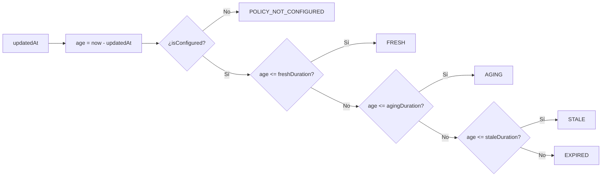

# Modelo de Frescura y Vigencia Temporal de Datos Operacionales

**Proyecto:** AguaCION / Agua Segura Perú (SUNASS)
**Hito:** Hito 3A
**Fecha:** 11 de septiembre de 2026
**Estado:** ESPECIFICACIÓN TÉCNICA BASE (Revisión Correctiva de Rigor)

---

## 1. Principio Fundamental: La Información en Emergencia Tiene Vida Útil

En una catástrofe, una afirmación como *"Hay agua disponible en el Parque Dammert"* solo es útil si se conoce con certeza cuándo fue emitida. Un reporte con 10 minutos de antigüedad ofrece un alto grado de fiabilidad; el mismo reporte tras 6 horas sin reabastecimiento suele ser incierto y peligroso.

El modelo operacional de AguaCION establece que:
1. Ninguna observación operacional existe sin un timestamp de emisión (`updatedAt`).
2. Todo estado dinámico debe ser evaluado contra una política de frescura ([`FreshnessPolicy`](lib/domain/source/freshness_policy.dart)) en el instante de consulta.
3. La aplicación tiene prohibido mostrar un punto como "Disponible" sin advertir explícitamente el tiempo transcurrido desde la última actualización.
4. **CERO TTLs PRODUCTIVOS HARDCODEADOS:** El sistema no impone ventanas de validez temporal arbitrarias por defecto. Todos los umbrales son configurables y, mientras no exista validación formal de SUNASS/SEDAPAL, la postura productiva por defecto es [`FreshnessState.policyNotConfigured`](lib/domain/source/freshness.dart#L19).

---

## 2. Estados de Frescura ([`FreshnessState`](lib/domain/source/freshness.dart))

| Estado | Significado Técnico | Comportamiento en la Interfaz |
| :--- | :--- | :--- |
| **`fresh` (Fresco)** | La observación está dentro de la ventana configurada de alta fiabilidad temporal. | Se muestra con indicador neutro positivo: *"Actualizado hace 15 min"*. |
| **`aging` (Envejeciendo)** | La observación aún es razonable, pero se aproxima al límite de confiabilidad configurado. | Se muestra con advertencia preventiva: *"Actualizado hace 2 h — Sujeto a cambios"*. |
| **`stale` (Desactualizado)** | La observación superó el umbral configurado. Es altamente probable que las condiciones hayan cambiado. | Advertencia visible: *"Datos desactualizados (hace 4 h). Verificar antes de acudir"*. |
| **`expired` (Expirado)** | La validez formal ha caducado (se superó `validUntil` o el tiempo máximo de expiración). | Se considera no garantizado o cerrado por fin de turno. |
| **`unknown` (Desconocido)** | No existe registro de actualización o el timestamp es anómalo/nulo. | Se informa que no hay datos de tiempo real para este punto. |
| **`policyNotConfigured` (Sin Política)** | No se han establecido ni validado normativamente los umbrales de frescura. | Se muestra el tiempo transcurrido exacto con advertencia: *"Política de vigencia no configurada por la autoridad"*. |

---

## 3. Políticas Configurables de Frescura ([`FreshnessPolicy`](lib/domain/source/freshness_policy.dart))

Diferentes activos y eventos tienen dinámicas de cambio drásticamente distintas. Por ello, el sistema rechaza un TTL único y universal, adoptando estructuras configurables por categoría:

### 3.1. Postura Productiva por Defecto: No Configurada
- **Estado:** `FreshnessPolicy.unconfigured` (`POLICY_NOT_CONFIGURED`).
- **Valores:** `freshDuration = null`, `agingDuration = null`, `staleDuration = null`.
- **Razón Institucional:** Evitar que el software tome decisiones autónomas de expiración basadas en suposiciones no normadas por SUNASS ni SEDAPAL.

### 3.2. Valores de Ejemplo para Pruebas y Simulación
> [!CAUTION]
> **EXAMPLE ONLY — NOT INSTITUTIONALLY VALIDATED**
> Los siguientes parámetros se utilizan exclusivamente para tests unitarios locales y demostraciones sintéticas (`LOCAL_SIMULATION / DEMO_ONLY`). No representan reglas productivas oficiales.

- **Simulación para Puntos Fijos (Ejemplo Demo):**
  - `freshDuration`: $1\text{ hora}$ *(EXAMPLE ONLY)*
  - `agingDuration`: $3\text{ horas}$ *(EXAMPLE ONLY)*
  - `staleDuration`: $6\text{ horas}$ *(EXAMPLE ONLY)*
- **Simulación para Cisternas Móviles (Ejemplo Demo):**
  - `freshDuration`: $15\text{ minutos}$ *(EXAMPLE ONLY)*
  - `agingDuration`: $45\text{ minutos}$ *(EXAMPLE ONLY)*
  - `staleDuration`: $2\text{ horas}$ *(EXAMPLE ONLY)*
- **Simulación para Incidentes Viales (Ejemplo Demo):**
  - `freshDuration`: $2\text{ horas}$ *(EXAMPLE ONLY)*
  - `agingDuration`: $6\text{ horas}$ *(EXAMPLE ONLY)*
  - `staleDuration`: $12\text{ horas}$ *(EXAMPLE ONLY)*

---

## 4. Reglas de Visualización y Transparencia

1. **Prohibición de Ocultar Antigüedad:** Bajo ninguna circunstancia la interfaz de usuario de AguaCION mostrará un letrero de *"Disponible"* sin acompañarlo de la etiqueta temporal calculada mediante [`FreshnessPolicy.formatElapsed(updatedAt, now)`](lib/domain/source/freshness_policy.dart#L81) (e.g. *"hace 42 min"*, *"hace 3 h"*).
2. **Mantenimiento del Punto en el Mapa:** Que la información operacional de un punto esté desactualizada (`stale`) o sin política configurada (`policyNotConfigured`) **no significa que el punto deba ser borrado del mapa**. El punto físico sigue existiendo en el catastro oficial; la aplicación debe mostrarlo con la correspondiente advertencia de incertidumbre.
