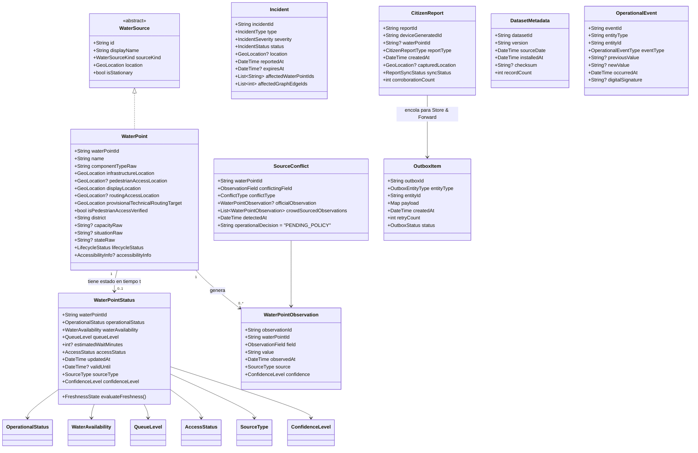

# Especificación Arquitectónica del Modelo de Dominio Operacional

**Proyecto:** AguaCION / Agua Segura Perú (SUNASS)
**Hito:** Hito 3A
**Fecha:** 11 de septiembre de 2026
**Estado:** ESPECIFICACIÓN TÉCNICA BASE (Revisión Correctiva de Rigor)

---

## 1. Visión General de la Arquitectura de Dominio

El modelo operacional de **AguaCION** está diseñado bajo los principios de *Domain-Driven Design (DDD)* y *Clean Architecture*. Es un modelo de dominio puro en Dart, totalmente desacoplado de frameworks de UI, motores de persistencia y servicios de red.

El modelo resuelve la disyuntiva crítica entre:
1. **Infraestructura Permanente:** Bienes físicos patrimoniales (pozos, reservorios, manifolds) con coordenadas y atributos estáticos.
2. **Observaciones Operacionales Temporales:** Estados dinámicos de emergencia (disponibilidad de agua, presión, colas, bloqueos y vigencia temporal).

---

## 2. Diagrama de Relaciones de Entidades del Dominio

---

## 3. Desglose de Paquetes de Dominio

### 3.1. Paquete `water` (Infraestructura y Acceso Peatonal)
- **[`WaterPoint`](lib/domain/water/water_point.dart):** Entidad raíz de infraestructura patrimonial. No posee atributos temporales.
- **Acceso Peatonal Separado:**
  - `displayLocation`: Utiliza `infrastructureLocation` para representación visual en el mapa.
  - `routingAccessLocation`: Retorna `pedestrianAccessLocation` únicamente si ha sido verificado en sitio. Si es nulo, el acceso permanece como no validado (`UNVERIFIED_ACCESS_LOCATION`).
  - `provisionalTechnicalRoutingTarget`: Fallback provisional para el enrutador POC técnico. Labeled explicitly: `PROVISIONAL_TECHNICAL_ROUTING_TARGET`. **Cero coordenadas inventadas.**
- **[`LifecycleStatus`](lib/domain/water/lifecycle_status.dart):** Enum del ciclo de vida del activo (`active`, `missingFromLatestSource`, `pendingReview`, `retired`).
- **[`WaterPointStatus`](lib/domain/water/water_point_status.dart):** Observación dinámica acotada en el tiempo (`updatedAt`, `validUntil`) con soporte de `unknown` explícito.
- **[`OperationalStatus`](lib/domain/water/operational_status.dart):** `unknown`, `operational`, `limited`, `temporarilyUnavailable`, `closed`.
- **[`WaterAvailability`](lib/domain/water/water_availability.dart):** `unknown`, `available`, `low`, `temporarilyEmpty`, `unavailable`.
- **[`QueueLevel`](lib/domain/water/queue_level.dart):** `unknown`, `low`, `medium`, `high`, `saturated`. Ordinal, sin minutos inventados.
- **[`AccessStatus`](lib/domain/water/access_status.dart):** `unknown`, `accessible`, `restricted`, `blocked`, `closed`.
- **[`AccessibilityInfo`](lib/domain/water/accessibility_info.dart):** Movilidad reducida con todos los campos anulables por defecto.
- **[`WaterSource`](lib/domain/water/water_source.dart) & [`TankerTruckProfile`](lib/domain/water/water_source.dart#L39):** Contrato polimórfico y compatibilidad futura para camiones cisterna.
- **[`SourceConflict`](lib/domain/water/observation_model.dart#L108):** Representación formal del conflicto (`status = CONFLICTING_INFORMATION`, `operationalDecision = PENDING_POLICY`). **No resuelve unilateralmente quién tiene razón.**

### 3.2. Paquete `source` (Procedencia, Confianza y Frescura)
- **[`SourceType`](lib/domain/source/source_type.dart):** `officialSunass`, `officialSedapal`, `coe`, `accreditedOperator`, `citizenReport`, `systemInference`, `localSimulation` (flag `isSimulation`).
- **[`ConfidenceLevel`](lib/domain/source/confidence_level.dart):** `unknown`, `low`, `medium`, `high`, `verified`.
- **[`FreshnessState`](lib/domain/source/freshness.dart):** `fresh`, `aging`, `stale`, `expired`, `unknown`, `policyNotConfigured`.
- **[`FreshnessPolicy`](lib/domain/source/freshness_policy.dart):** Umbrales configurables y anulables. Por defecto `POLICY_NOT_CONFIGURED` (**0 TTLs productivos hardcodeados**). Las políticas de demo están marcadas `isSimulationOrDemo` (`EXAMPLE ONLY — NOT INSTITUTIONALLY VALIDATED`).
- **[`CitizenCorroborationPolicy`](lib/domain/source/citizen_corroboration_policy.dart):** Umbrales de agregación (`minimumReports`, `timeWindow`) configurables y anulables (**0 umbrales arbitrarios hardcodeados**, `PENDING_INSTITUTIONAL_VALIDATION`).

### 3.3. Paquete `incident` (Siniestros y Afectaciones Topológicas)
- **[`Incident`](lib/domain/incident/incident.dart):** Modela contingencias viales conectadas a las aristas del grafo peatonal (`affectedGraphEdgeIds`).

### 3.4. Paquete `reporting` (Reportes Ciudadanos y Store & Forward)
- **[`CitizenReport`](lib/domain/reporting/citizen_report.dart):** Observación ciudadana con `deviceGeneratedId` idempotente. Jamás sobrescribe directamente el estado oficial.
- **[`OutboxItem`](lib/domain/reporting/outbox_item.dart):** Cola duradera para transmisión asíncrona fuera de línea (*dead-letter* con control de reintentos). Prohibido usar `SharedPreferences`.

### 3.5. Paquete `metadata` (Versionado de Datasets)
- **[`DatasetMetadata`](lib/domain/metadata/dataset_metadata.dart):** Registro de versión, fecha de corte, fecha de instalación y hash SHA-256.

### 3.6. Paquete `audit` (Trazabilidad Institucional)
- **[`OperationalEvent`](lib/domain/audit/operational_event.dart):** Registro append-only inmutable.
  - `DIGITAL_SIGNATURE_AUDIT_IMPLEMENTED = NO`
  - Firmas digitales y sellado de tiempo criptográfico: `FUTURE_SECURITY_DESIGN, NOT_IMPLEMENTED, NOT_VALIDATED`.

### 3.7. Paquete `recommendation` (Candidatos y Resultados Explicables)
- **[`WaterPointCandidate`](lib/domain/recommendation/recommendation_candidate.dart):** Candidato evaluado con distancias reales A*, frescura y razones explicables.
- **Filtros Duros Potenciales:** Clasificados taxativamente en `CONFIRMED_TECHNICAL`, `PENDING_INSTITUTIONAL_VALIDATION` y `FUTURE`.
- **Resultados para UI:** **RECOMENDADO**, **ALTERNATIVA**, **MÁS CERCANO** (sin la expresión "Recomendado Seguro").
- **Distrito:** `DISTRICT_HARD_FILTER = NO`.
  > *"El distrito no excluye automáticamente candidatos. Un punto de otro distrito puede ser evaluado si no existe una regla institucional de área de servicio."*

### 3.8. Paquete `repositories` (Contratos Abstractos)
- Interfaces abstractas en [`water_repositories.dart`](lib/domain/repositories/water_repositories.dart) para desacoplamiento total.
