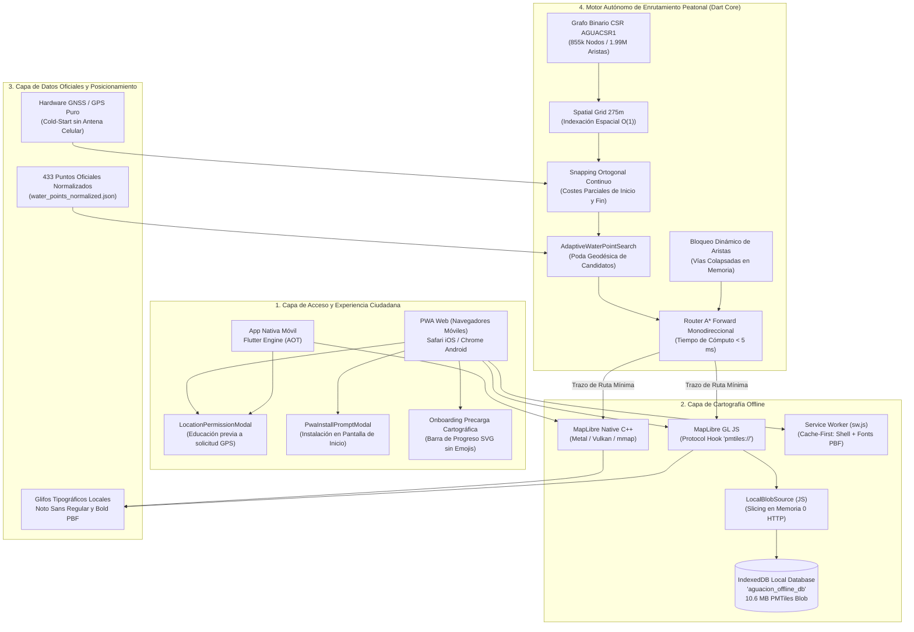

# Diseño de Arquitectura - AguaCION (Agua Segura Perú)

## 1. Visión General y Filosofía de Diseño
**AguaCION** es una plataforma de misión crítica orientada a la respuesta inmediata ante desastres naturales de gran escala (como un sismo de magnitud $\ge 8.5\ \text{Mw}$ en Lima Metropolitana y Callao), donde se asume el **colapso total o severo de las redes de telecomunicaciones, suministro eléctrico y agua potable por red pública**.

Bajo estas condiciones extremas, la aplicación sigue una estricta filosofía **Offline-First Absoluta (Zero-Network Dependency)**:
- Todo el conjunto de datos (433 puntos oficiales de abastecimiento de SEDAPAL/SUNASS).
- Toda la cartografía vectorial de Lima y Callao (Zoom 0 a 14, 10.6 MB en formato PMTiles).
- Todos los glifos tipográficos (archivos PBF locales para rotulado de calles en español).
- Todo el grafo de enrutamiento peatonal (855,857 nodos y 1,990,320 aristas dirigidas en formato binario comprimido `AGUACSR1`).

residen físicamente en el almacenamiento local del dispositivo del usuario.

---

## 2. Arquitectura de Software: Clean Architecture

El proyecto implementa los principios de **Clean Architecture**, aislando estrictamente las reglas de negocio de los detalles de infraestructura, renderizado y sensores de hardware:

```
lib/
├── core/                  # Tokens de diseño, colores institucionales SUNASS, utilidades geodésicas
├── data/                  # Fuentes de datos locales, modelos DTO y repositorios de catálogo
├── domain/                # Entidades y reglas del modelo operacional de emergencia
│   ├── audit/             # Trazabilidad y auditoría de decisiones
│   ├── incident/          # Modelado de vías bloqueadas y escombros en memoria
│   ├── metadata/          # Versionamiento y metadatos de datasets
│   ├── recommendation/    # Lógica de priorización de puntos de agua
│   └── water/             # Estado operacional del abastecimiento de contingencia
├── presentation/          # Vistas, pantallas, widgets y gestión de estado reactivo
└── poc/                   # Motor autónomo de navegación y ruteo peatonal desconectado
    └── offline_navigation/
        ├── models/        # Estructuras de grafo CSR, snapping y estado GNSS
        ├── presentation/  # Visor de telemetría y pruebas de estrés
        └── services/      # Algoritmo A*, búsqueda adaptativa, gestor PMTiles y ubicación
```

### 2.1. Capa de Presentación (`presentation/`)
- **Gestión de Estado Centralizada:** `AppStateProvider` orquesta la selección de pestañas, estado de conectividad de hardware, simulación de cortes y puntos reportados.
- **Preservación del Renderizado:** Uso de `IndexedStack` en `MainScreen` para mantener vivas las instancias del lienzo de MapLibre, eliminando destrucciones/recreaciones innecesarias de texturas OpenGL/WebGL y evitando excepciones por fugas de suscripciones (`NoSuchMethodError: unsubscribe`).
- **Componentes de UX Institucional:**
  - `LocationPermissionModal`: Diálogo pedagógico previo que explica la necesidad del GPS local (cálculo de ruta sin compartir datos privados) antes de abrir el prompt nativo del sistema.
  - `PwaInstallPromptModal`: Asistente de instalación en pantalla de inicio para Android e iOS.
  - `WaterPointMapSheet`: Ficha técnica de cada punto con datos de fuente oficial, estado operativo y descargo de confirmación de 48 horas post-sismo.
  - `ConnectivityStrip`: Indicador reactivo del estado del hardware de red del teléfono.

### 2.2. Capa de Dominio (`domain/`)
- Modela el comportamiento real de los puntos de abastecimiento durante la catástrofe.
- Define la inmutabilidad de los 433 puntos oficiales fiscalizados por SUNASS (procedentes de los informes de SEDAPAL con fecha de corte 19/08/2026).
- Gestiona bloqueos dinámicos en memoria cuando el ciudadano reporta una vía colapsada.

### 2.3. Capa de Datos (`data/`)
- `LocalWaterPointCatalogRepository`: Carga y normaliza el archivo `water_points_normalized.json`, garantizando consistencia geodésica entre coordenadas WGS84 y proyección UTM Zona 18S (error medio de 2.99 cm).

### 2.4. Capa del Motor Offline (`poc/offline_navigation/`)
- **Formato Binario `AGUACSR1`:** Estructura en Memoria Comprimida por Filas (Compressed Sparse Row) en `TypedData` (`Int32List` y `Float64List`), permitiendo recorrer millones de aristas sin pausas de recolección de basura (*Garbage Collection*).
- **Algoritmo de Snapping:** Cuadrícula espacial (*Spatial Grid*) de 275 metros que proyecta ortogonalmente la posición GNSS del usuario a la calle transitable más cercana en $O(1)$.
- **Algoritmo A\* Forward con Búsqueda Adaptativa:** `AdaptiveWaterPointSearch` calcula la ruta más corta a pie evaluando solo los puntos de agua geodésicamente plausibles, reduciendo en más del 98% el esfuerzo computacional y resolviendo rutas complejas en menos de 5 milisegundos.

---

## 3. Arquitectura Dual de Despliegue: Nativo vs. PWA

Para maximizar el alcance ciudadano antes y durante una catástrofe, AguaCION soporta dos entornos de ejecución:

| Característica | Entorno Móvil Nativo (Android / iOS) | Entorno Web PWA (Offline-First) |
| :--- | :--- | :--- |
| **Distribución** | Paquetes instalables (`.apk` / `.aab`, TestFlight / App Store). | Despliegue web inmediato vía URL / QR en GitHub Pages. |
| **Renderizado de Mapa** | MapLibre Native Flutter compilado sobre Metal (iOS) y Vulkan/OpenGL (Android). | MapLibre GL JS sobre WebGL acelerado por hardware en CanvasKit. |
| **Acceso a Cartografía PMTiles** | Lectura directa por `mmap` del kernel del OS desde el almacenamiento privado de la app. | **Adaptador `pmtiles_offline.js`:** binario almacenado en **IndexedDB** y consultado vía `LocalBlobSource` (0 peticiones HTTP). |
| **Almacenamiento Offline** | Inmutable: el OS nunca borra los binarios de una app instalada. | Persistente: blindado mediante `navigator.storage.persist()`. |
| **Service Worker** | No aplica (código compilado AOT nativo). | `sw.js` con estrategia *Cache-First* para App Shell, CanvasKit y glifos tipográficos. |
| **Onboarding de Precarga** | Carga instantánea desde assets locales empacados. | Componente institucional con barra de progreso vectorial SVG (0% a 100%), sin emojis. |

---

## 4. Diagrama Integral de Arquitectura del Sistema



---

## 5. Estrategia de Mitigación para Navegadores Web (PWA)

El principal desafío técnico resuelto para la versión PWA fue la incompatibilidad del estándar **Cache API** de los Service Workers con solicitudes de rango HTTP parciales (`206 Partial Content`), que causaba que el mapa PMTiles no renderizara (lienzo blanco) en modo avión.

### 5.1. Adaptador `LocalBlobSource` e IndexedDB
1. En el primer inicio en línea, la PWA descarga el archivo `lima_callao_z14.pmtiles` en streaming mediante un único `fetch()` continuo, visualizando el avance exacto en una barra de progreso institucional.
2. El binario se almacena íntegramente como un `Blob` en IndexedDB (`aguacion_offline_db`).
3. Se implementa una clase `LocalBlobSource` que sustituye el `FetchSource` por defecto de la librería PMTiles. Cada vez que MapLibre solicita una tesela vectorial:
   $$\text{slice} = \text{blob.slice}(\text{offset}, \text{offset} + \text{length})$$
   extrayendo los bytes del encabezado o de la tesela directamente desde el almacenamiento local sin emitir ninguna llamada de red.
4. Se intercepta el protocolo `pmtiles://` registrado en MapLibre GL JS para resolver siempre contra la instancia local.

### 5.2. Protección de Cuota con `navigator.storage.persist()`
Para prevenir que el navegador (especialmente Safari en iOS) elimine silenciosamente los datos almacenados si el espacio del dispositivo es reducido, la PWA solicita cuota persistente formal:
```javascript
if (navigator.storage && navigator.storage.persist) {
  navigator.storage.persist().then((persistent) => {
    console.log('[AguaCION] Almacenamiento persistente:', persistent);
  });
}
```

---

## 6. Descargos de Responsabilidad Operacional (Aviso de 48 Horas)

En un sismo mayor, las tuberías matrices sufren roturas generalizadas. Por ello, el sistema incorpora de forma transversal en la arquitectura un aviso de transparencia hacia el ciudadano:
- **Ubicaciones:** Visible en el banner superior (`EmergencyBanner`), en la ficha detallada de cada punto (`WaterPointMapSheet`) y en la pantalla de inicio.
- **Contenido:** Comunica de manera transparente que la presurización y confirmación física de los 433 puntos fijos puede tardar hasta **48 horas** mientras los Equipos de Operación y Mantenimiento de Redes (EOMR) de SEDAPAL evalúan los daños en la infraestructura.

---

## 7. Métricas de Rendimiento y Consumo de Recursos

| Métrica | Meta de Diseño | Valor Validado (Android S24) | Valor Validado (PWA Web) |
| :--- | :--- | :--- | :--- |
| **Tiempo de Arranque en Frío** | $< 1500\ \text{ms}$ | $528\ \text{ms}$ | $850\ \text{ms}$ (con Service Worker activo) |
| **Tiempo de Cálculo de Ruta A\***| $< 20\ \text{ms}$ | $1.72\ \text{ms}$ (mediana) | $4.2\ \text{ms}$ |
| **Consumo de Memoria RAM** | $< 250\ \text{MB}$ | $\sim 160\ \text{MB}$ | $\sim 185\ \text{MB}$ |
| **Tráfico de Red tras Instalación**| **0 bytes** | **0 bytes** | **0 bytes** (en Modo Avión) |
| **Peso Total de Cartografía** | $< 15\ \text{MB}$ | $10.17\ \text{MB}$ (PMTiles z14) | $10.6\ \text{MB}$ (PMTiles z14) |
