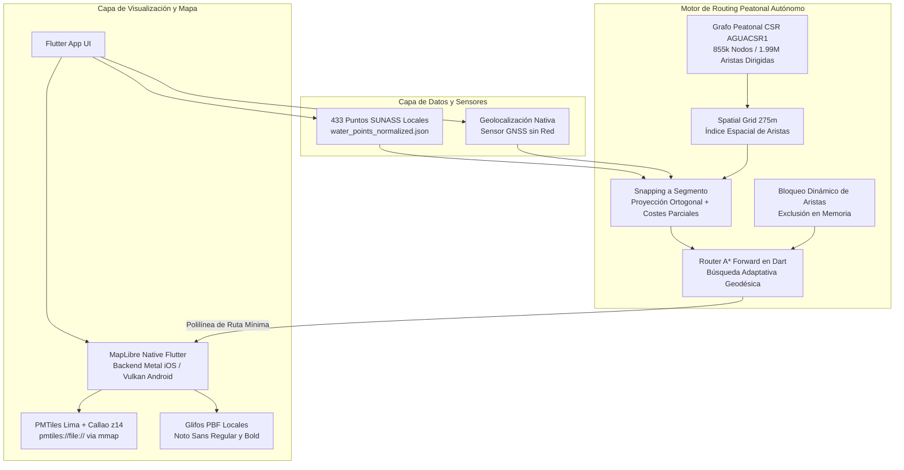

# Diseño de Arquitectura - AguaCION

## 1. Visión General de la Arquitectura
AguaCION emplea una **Arquitectura Limpia (Clean Architecture)** adaptada a las rigurosas necesidades de un entorno de ejecución *Offline-First*. La aplicación está construida en Flutter (Dart) y divide estrictamente las responsabilidades entre la representación visual, las reglas de negocio de la emergencia y el ruteo geográfico desconectado.

## 2. Capas de la Aplicación

El código fuente (`lib/`) está distribuido en las siguientes capas modulares:

### 2.1 Capa de Presentación (`presentation/`)
- Interfaz de usuario (UI/UX) desarrollada bajo lineamientos de Material/Cupertino.
- Vistas, pantallas interactivas y widgets que interactúan con el estado global de la app.

### 2.2 Capa de Dominio (`domain/`)
- Contiene el modelo operacional y conceptual de la plataforma.
- Agrupa la lógica de negocio pura que no depende de librerías de UI o bases de datos externas.
- **Submódulos:** `audit/` (registros), `incident/` (incidentes y bloqueos), `metadata/`, `recommendation/` (recomendaciones), `reporting/`, `source/` y `water/` (estado operativo del abastecimiento).

### 2.3 Capa de Datos (`data/`)
- Responsable del manejo de fuentes de datos (JSONs locales), preferencias y transformaciones de los datos hacia los modelos del dominio.

### 2.4 Capa Core (`core/`)
- Tokens de diseño, paletas de colores institucionales y utilidades transversales.
- Envoltorios (*wrappers*) de servicios nativos como el acceso al sensor de geolocalización.

### 2.5 Capa POC (Motor Offline - `poc/`)
- Aísla la ingeniería de ruteo peatonal desconectado y mapas en memoria.
- Integra el **Grafo Peatonal CSR** (`AGUACSR1`) alojado en buffers binarios de alta velocidad (`TypedData`).
- Conecta directamente con la representación de MapLibre Native para el renderizado cartográfico.

---

## 3. Diagrama de Arquitectura de Sistemas (Offline-First)

El siguiente diagrama detalla la integración técnica y funcional que permite al sistema operar íntegramente dentro del dispositivo (0 llamadas de red).

---

## 4. Stack Tecnológico Base
- **Frontend / UI:** Flutter SDK, Dart.
- **Renderizado de Mapa:** MapLibre Native (`maplibre_gl`).
- **Cartografía:** Formato vector PMTiles (lectura vía `mmap` C++).
- **Tipografías Offline:** Archivos PBF locales para soporte de caracteres en español.
- **Geolocalización:** API Nativa `geolocator` para uso del hardware GNSS/GPS puro.
- **Rendimiento Computacional:** Algoritmo de Búsqueda Adaptativa y estructuras de datos en arreglos contiguos (`Int32List`, `Float64List`) para evitar saturación de memoria RAM.
