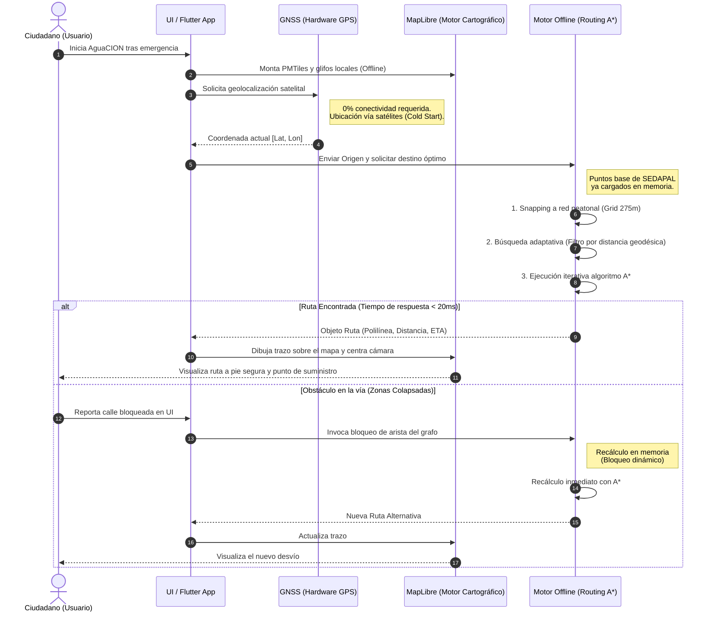

# Flujograma de Operación - AguaCION

El siguiente flujograma ilustra la secuencia de eventos que ocurre internamente cuando un ciudadano utiliza la aplicación durante un escenario de emergencia mayor (sin internet, sin redes celulares y sin energía eléctrica).

## 1. Descripción del Flujo de Usuario (End-to-End)

1. **Apertura de la Aplicación en Frío:** Tras un sismo u otra emergencia, el usuario inicia la app. El motor se levanta en memoria leyendo todos sus activos locales en milisegundos.
2. **Adquisición de Ubicación GNSS:** El dispositivo, utilizando únicamente hardware satelital de posicionamiento, obtiene las coordenadas del ciudadano (Latitud, Longitud).
3. **Mapeo al Grafo Peatonal (*Snapping*):** Las coordenadas del usuario son proyectadas ortogonalmente a la calle peatonal transitable más cercana utilizando una cuadrícula espacial de complejidad O(1).
4. **Búsqueda Inteligente:** El sistema evalúa localmente los 433 puntos de SEDAPAL precargados. Realiza una "poda espacial" (*AdaptiveWaterPointSearch*) para analizar solo las opciones verdaderamente factibles, evitando pérdida de batería en cálculos innecesarios.
5. **Algoritmo de Ruteo A*:** Se calcula la ruta más corta a pie utilizando el grafo binario comprimido de Lima y Callao.
6. **Ruta Mostrada:** Se pinta un trayecto en un mapa base 100% vector offline. Se muestra tiempo, distancia y dirección a seguir.
7. **Contingencias (Vías Bloqueadas):** Si el ciudadano encuentra una vía intransitable o escombros, el sistema bloquea esa calle en la memoria de la aplicación y traza un desvío de inmediato.

---

## 2. Flujograma del Proceso Interno

