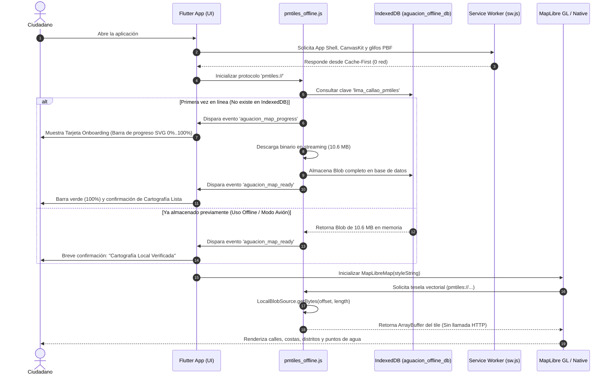
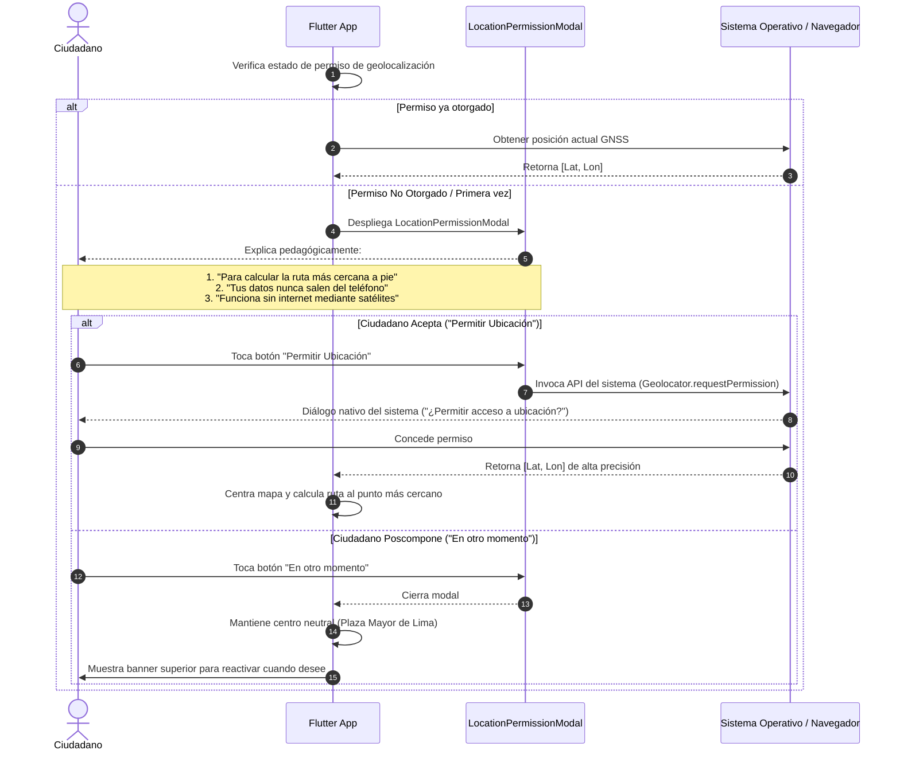
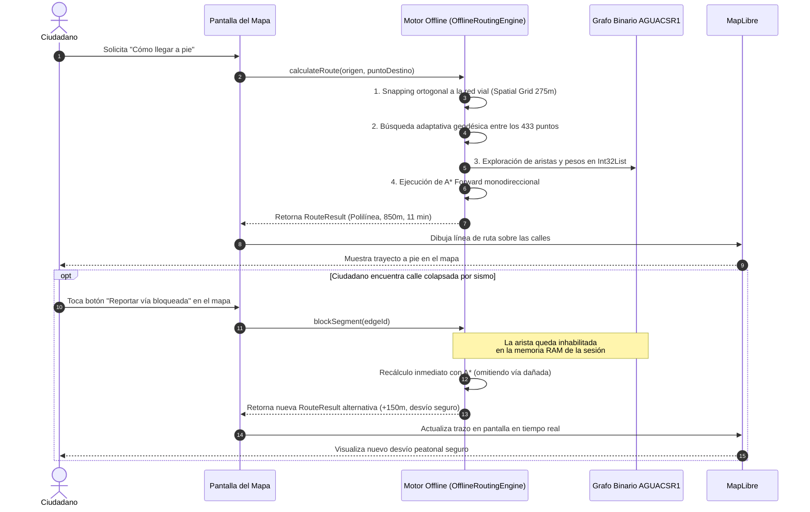

# Flujogramas y Secuencia de Operación - AguaCION

El presente documento detalla la secuencia técnica y la experiencia de usuario (End-to-End) en la aplicación **AguaCION**, abarcando tanto el primer contacto del ciudadano con la plataforma como la respuesta inmediata durante una catástrofe sin internet ni energía eléctrica.

---

## 1. Flujograma General del Ciclo de Vida del Ciudadano

```mermaid
flowchart TD
    START([1. Inicio de la Aplicación]) --> DETECT{¿Primera vez en PWA\no falta mapa?}
    
    DETECT -- Sí (PWA Web) --> ONB_DL["Descarga Streaming de Cartografía\n(Barra de Progreso SVG: 0% a 100%)"]
    ONB_DL --> IDB_STORE["Guardado de PMTiles (10.6 MB)\nen IndexedDB Local"]
    IDB_STORE --> PERSIST["Solicitud de Cuota Persistente\nnavigator.storage.persist()"]
    PERSIST --> PROMPT_PWA{"¿Es navegador PWA\nno instalado?"}
    
    DETECT -- No (Ya en Caché o App Nativa) --> IDB_LOAD["Montaje de PMTiles desde Memoria\n(LocalBlobSource o mmap OS)"]
    IDB_LOAD --> PROMPT_PWA
    
    PROMPT_PWA -- Sí --> MOD_A2HS["Modal Asistido de Instalación\n(Agregar a Pantalla de Inicio)"]
    PROMPT_PWA -- No / Instalado --> DISCLAIMER["Despliegue de Aviso Institucional\n(Puntos sujetos a confirmación 48h)"]
    MOD_A2HS --> DISCLAIMER
    
    DISCLAIMER --> LOC_CHECK{"¿Tiene permiso\nde Ubicación?"}
    
    LOC_CHECK -- No --> MOD_PRIMER["Modal Educativo de Ubicación\n(Explica cálculo local sin subir datos)"]
    MOD_PRIMER --> REQ_GPS["Solicitud de GPS Nativo al OS"]
    REQ_GPS --> LOC_OK{"¿Permiso concedido?"}
    
    LOC_CHECK -- Sí --> GET_COORDS["Lectura de Coordenadas Satelitales\n(Sensor GNSS Cold-Start sin red)"]
    LOC_OK -- Sí --> GET_COORDS
    LOC_OK -- No --> FALLBACK_MAP["Centro Neutral (Plaza Mayor de Lima)\nSelección manual en el mapa"]
    
    GET_COORDS --> SNAPPING["Snapping Ortogonal a Red Vial\n(Spatial Grid 275m)"]
    FALLBACK_MAP --> MANUAL_SNAP["Snapping del Punto Seleccionado"]
    
    SNAPPING --> ADAPT_SEARCH["Búsqueda Adaptativa Geodésica\n(Poda de los 433 puntos oficiales)"]
    MANUAL_SNAP --> ADAPT_SEARCH
    
    ADAPT_SEARCH --> ASTAR["Ejecución Algoritmo A* Forward\n(Cálculo sobre Grafo Binario AGUACSR1)"]
    ASTAR --> RENDER_ROUTE["Visualización de Ruta Óptima a Pie\n(Polilínea, Distancia, Tiempo Estimado)"]
    
    RENDER_ROUTE --> OBSTACLE{"¿Encuentra calle bloqueada\npor escombros?"}
    OBSTACLE -- No --> REACH_POINT([Llegada al Punto de Abastecimiento])
    OBSTACLE -- Sí --> BLOCK_EDGE["Reportar Vía Bloqueada en UI\n(Bloqueo Dinámico de Arista en RAM)"]
    BLOCK_EDGE --> ASTAR
```

---

## 2. Diagrama de Secuencia: Arranque, Precarga y Renderizado Offline

Detalla la interacción entre la interfaz gráfica, los adaptadores de almacenamiento y el motor de teselas vectoriales:

---

## 3. Diagrama de Secuencia: Permiso Amigable de Ubicación (Location Primer)

Para evitar que el usuario bloquee el GPS ante la alerta fría del navegador, se implementa una secuencia pedagógica previa:

---

## 4. Diagrama de Secuencia: Ruteo A* Autónomo y Bloqueo Dinámico de Vías

Detalla el procesamiento matemático desconectado cuando el usuario se desplaza hacia un punto de suministro y se topa con escombros o vías intransitables:

